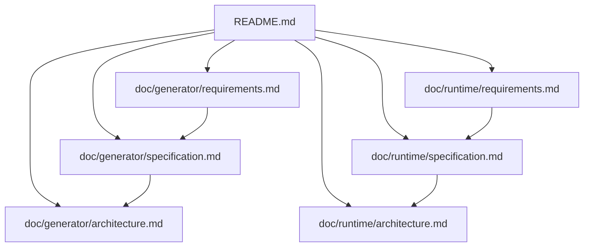

# Kek State Schema Prototype

This repository prototypes two related components:

- A JSON state-schema generator that emits plain C data structures and verification helpers.
- A small C runtime with event dispatch, automatic read-only hook multithreading, runtime state registration, and stream state support.
- A local no-framework browser editor for project-folder JSON schemas.

The current goal is to keep generated state data and runtime behavior separate. The generator owns the C data ABI. The runtime owns event processing and runtime-managed state callbacks.

## Documentation

Generator documentation:

- [Generator Requirements](doc/generator/requirements.md)
- [Generator Specification](doc/generator/specification.md)
- [Generator Architecture](doc/generator/architecture.md)

Runtime documentation:

- [Runtime Requirements](doc/runtime/requirements.md)
- [Runtime Specification](doc/runtime/specification.md)
- [Runtime Architecture](doc/runtime/architecture.md)
- [Generator-Assisted Parallel Hook Scheduling Proposal](doc/runtime/parallel-hook-generation-proposal.md)

## Repository Layout

| Path | Purpose |
| --- | --- |
| `tools/generate_states.py` | JSON schema to C generator. |
| `tools/kek_editor.py` | Local HTTP server for the browser editor. |
| `editor/` | Plain HTML/CSS/JS project schema editor. |
| `runtime/` | C runtime modules. |
| `examples/runtime_smoke/` | Comprehensive runtime smoke example. |
| `Makefile` | Builds the runtime library used by examples. |
| `doc/generator/` | Generator documentation. |
| `doc/runtime/` | Runtime documentation. |

## Build Commands

| Command | Purpose |
| --- | --- |
| `make runtime` | Build `lib/libkek_runtime.a`. |
| `make all` | Build `lib/libkek_runtime.a`. |
| `make smoke` | Build and run the runtime smoke example. |
| `make dynamic-hook-smoke` | Build and run a runtime smoke test for debug dynamic hook loading. |
| `make runtime-stress-generate` | Generate the large schema-first runtime stress example. |
| `make runtime-stress` | Build and run the large generated runtime stress example. |
| `make runtime-stress-trace` | Run the stress example with runtime tracing enabled and print hotspot summaries. |
| `make game` | Build the raylib game with statically linked hook implementations. |
| `make game-debug-hooks` | Build the raylib game with hook implementations loaded from a dynamic library. |
| `make clean` | Remove runtime library build artifacts. |

## Runtime Smoke Example

`examples/runtime_smoke/main.c` exercises the runtime as an integration smoke test. It covers runtime initialization and destruction, event subscription and dispatch, stream read/write states, standard text bridge helpers, generated-style state slots, transactional state events, timer state updates, hook dispatch, automatic read-only hook multithreading, hook write authorization, state snapshots, drain behavior, and raw-mode no-op behavior for a non-TTY fd.

Run it with `make smoke`.

`examples/runtime_hook_dynamic/main.c` exercises debug dynamic hook loading. It verifies that a hook can be resolved from a shared library, that a failed reload leaves the previous implementation active, and that a later successful load swaps the implementation.

Run it with `make dynamic-hook-smoke`.

`examples/runtime_stress/runtime_stress.schema.json` is a larger schema-first integration workload for measuring runtime hotspots. It runs generated states and hooks against many dynamic slots, batch updates, stream events, timers, field filters, snapshots, rollback paths, write authorization, generated string setters, and generated slot helpers.

Run it with `make runtime-stress`. Run `make runtime-stress-trace` to write `build/runtime_stress_runtime.csv` and `build/runtime_stress_hooks.csv` and print the highest-total-time runtime and hook metrics.

## Runtime Todo List

Completed in the current runtime cleanup:

- Fixed idle write-stream readiness so streams do not keep `select()` alive when no fd is actually selected.
- Deduplicated runtime prepare/select/ready logic shared by run and drain.
- Fixed drain to wait on the same read/write fd sets it prepares.
- Propagated runtime state `prepare()` failures.
- Added event subscription/unsubscription status returns.
- Stopped event dispatch from invoking subscribers added during the same event dispatch pass.
- Derived event type count from the event enum sentinel.
- Removed file-scope global hook execution state and moved active hook context into `KekStateStore`.
- Added queue-capacity checks before generated state mutations that must publish events.
- Added hook error propagation, hook self-updates for declared writable state types, changed-field event masks, and hook field filters.
- Added idempotent duplicate event subscription handling and subscriber-list compaction on unsubscribe.
- Split single-object state storage from the instance-aware state-store implementation.
- Hardened stream readiness `EINTR` handling.
- Hardened standard text bridge null/capacity checks.
- Switched timers to monotonic time where available.
- Restored raw terminal mode during runtime destruction.
- Added a comprehensive runtime smoke example.

Remaining possible improvements:

- Add focused unit tests for event queue capacity, subscription mutation during dispatch, stream idle behavior, drain behavior, hook write authorization, state rollback, timer behavior, and standard IO edge cases.
- Replace library-internal `perror()`/stdio error reporting with explicit error codes or an optional runtime error callback.
- Consider opaque public structs for ABI flexibility once the prototype API stabilizes.
- Add configurable runtime capacities if fixed compile-time bounds become limiting.
- Add a readiness backend abstraction if `poll()` or platform-specific APIs become necessary.
- Decide whether `KekRuntimeStateReadyFn` should return status so ready-handler failures can propagate.
- Add runtime state unregister support if dynamic state lifetimes become a real use case.
- Add stronger raw-mode fd validation for applications that manage multiple terminal fds.

## Browser Editor

Run `python3 tools/kek_editor.py examples/game` and open `http://127.0.0.1:8080/`.

The editor serves the `examples/game` project folder by default. It loads JSON schema files from that
folder, saves schema changes back into that folder, and writes generated files to
`generated/`.

The editor is plain HTML, CSS, and JavaScript. It uses `tools/kek_editor.py` as a
small local API server and reuses the existing generator parser for validation.
