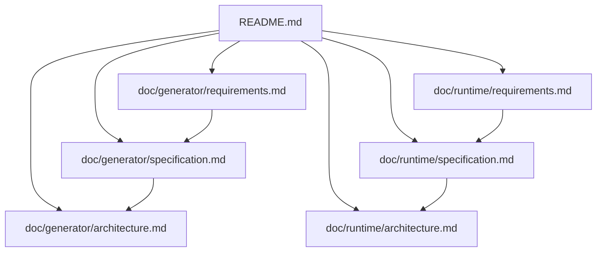

# Kek State Schema Prototype

This repository prototypes two related components:

- A `.kek` state-schema generator that emits plain C data structures and verification helpers.
- A small single-threaded C runtime with event dispatch, hook dispatch, runtime state registration, and stream state support.

The current goal is to keep generated state data and runtime behavior separate. The generator owns the C data ABI. The runtime owns event processing and runtime-managed state callbacks.

## Documentation

Generator documentation:

- [Generator Requirements](doc/generator/requirements.md)
- [Generator Specification](doc/generator/specification.md)
- [Generator Architecture](doc/generator/architecture.md)

Runtime documentation:

- [Runtime Requirements](doc/runtime/requirements.md)
- [Runtime Specification](doc/runtime/specification.md)
- [Runtime Architecture](doc/runtime/architecture.md)

## Repository Layout

| Path | Purpose |
| --- | --- |
| `tools/generate_states.py` | `.kek` schema to C generator. |
| `runtime/` | C runtime modules. |
| `generated/` | Generated C output. |
| `Makefile` | Generation, compile-check, runtime build, and cleanup targets. |
| `doc/generator/` | Generator documentation. |
| `doc/runtime/` | Runtime documentation. |

## Build Commands

| Command | Purpose |
| --- | --- |
| `make generate` | Run the schema generator. |
| `make check` | Generate and compile generated C. |
| `make runtime` | Build the runtime executable. |
| `make all` | Run `check` and build the runtime executable. |
| `make clean` | Remove build/runtime artifacts. |

## Runtime Example

`main.c` builds a small terminal dungeon demo around the generated `GameState`.
It registers stdin, stdout, and log streams with the runtime, stores generated
state through `KekStateStorage`, validates updates before swapping them in, and
renders the current state after game actions.

## Current Boundaries

Implemented in the generator:

- `state` declarations.
- Typed fields.
- `default` blocks.
- Simple `verify` blocks emitted as non-aborting `*_check()` functions.
- Generated `*_reset()` functions that restore defaults.
- C header/source generation.

Implemented in the runtime:

- Bounded event queue.
- Synchronous subscriber dispatch.
- Fixed-size runtime state registry.
- `select()`-based event loop.
- Runtime stream states for file descriptors.
- Rollback-safe generated state storage.
- Independent generated state slots.
- Multiple instances per generated state type.
- Generated hook descriptors.

Not implemented yet:

- Full language parsing.
- Compiled function, transition, or hook bodies.
- Full generated runtime wiring.
- Rollback semantics.
- Per-state queues.
- Generated-state ownership management.
- Hook body compilation.
- Hook transaction enforcement.
