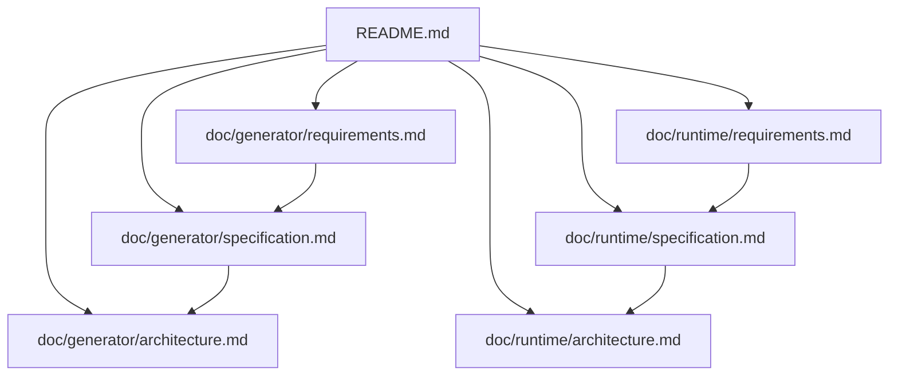

# Kek State Schema Prototype

This repository prototypes two related components:

- A JSON state-schema generator that emits plain C data structures and verification helpers.
- A small single-threaded C runtime with event dispatch, hook dispatch, runtime state registration, and stream state support.
- A local no-framework browser editor for project-folder JSON schemas.

The current goal is to keep generated state data and runtime behavior separate. The generator owns the C data ABI. The runtime owns event processing and runtime-managed state callbacks.

## Documentation

Generator documentation:

- [Generator Requirements](doc/generator/requirements.md)
- [Generator Specification](doc/generator/specification.md)
- [Generator Architecture](doc/generator/architecture.md)

Runtime documentation:

- [Runtime Requirements](doc/runtime/requirements.md)
- [Runtime Specification](doc/runtime/specification.md)
- [Runtime Architecture](doc/runtime/architecture.md)

## Repository Layout

| Path | Purpose |
| --- | --- |
| `tools/generate_states.py` | JSON schema to C generator. |
| `tools/kek_editor.py` | Local HTTP server for the browser editor. |
| `editor/` | Plain HTML/CSS/JS project schema editor. |
| `runtime/` | C runtime modules. |
| `examples/` | Example schemas, applications, and per-example Makefiles. |
| `examples/<name>/generated/` | Per-example generated C output. |
| `Makefile` | Builds the runtime library used by examples. |
| `doc/generator/` | Generator documentation. |
| `doc/runtime/` | Runtime documentation. |

## Build Commands

| Command | Purpose |
| --- | --- |
| `make runtime` | Build `lib/libkek_runtime.a`. |
| `make all` | Build `lib/libkek_runtime.a`. |
| `make clean` | Remove runtime library build artifacts. |
| `make -C examples/game` | Generate and build the game example. |
| `make -C examples/warehouse` | Generate and build the warehouse example. |

## Browser Editor

Run `python3 tools/kek_editor.py examples/game` and open `http://127.0.0.1:8080/`.

The editor serves the `examples/game` project folder by default. It loads JSON schema files from that
folder, saves schema changes back into that folder, and writes generated files to
`generated/`.

The editor is plain HTML, CSS, and JavaScript. It uses `tools/kek_editor.py` as a
small local API server and reuses the existing generator parser for validation.

## Runtime Example

`examples/game/main.c` builds a small terminal dungeon demo around generated states.
It registers stdin, stdout, and log streams with the runtime, stores generated
state through `KekStateStore`, validates updates before swapping them in, and
renders the current state after game actions.

## Current Boundaries

Implemented in the generator:

- `state` declarations.
- Typed fields.
- Schema enums emitted as C enum typedefs.
- Fixed-size field arrays with full-array defaults.
- Per-field defaults.
- Per-field `min`/`max` constraints emitted as non-aborting `*_check()` functions.
- Extra constructors as partial overrides of default constructors.
- Schema-declared named instances stored as `KekStateStore` slots.
- Generated `*_reset()` functions that restore defaults.
- C header/source generation.
- Snake-case generated state type macros.
- Generated default slot registration helper for `KekStateStore`.
- Generated dynamic create/delete/find helpers for per-state instances.
- Generated runtime binding helpers for declared slots and hooks.
- Generated string-field setters for single-string states such as standard input/output.

Implemented in the runtime:

- Bounded event queue.
- Synchronous subscriber dispatch.
- Fixed-size runtime state registry.
- `select()`-based event loop.
- Runtime stream states for file descriptors.
- Explicit write-stream flush support.
- Rollback-safe generated state storage.
- Independent generated state slots.
- Multiple instances per generated state type.
- Generated state slot creation/deletion events and deleted slot reuse.
- Generated hook descriptors.

Not implemented yet:

- Full language parsing.
- Compiled function, transition, or hook bodies.
- Full generated runtime wiring.
- Per-state queues.
- Generated-state ownership management.
- Hook body compilation.
- Hook transaction enforcement.
