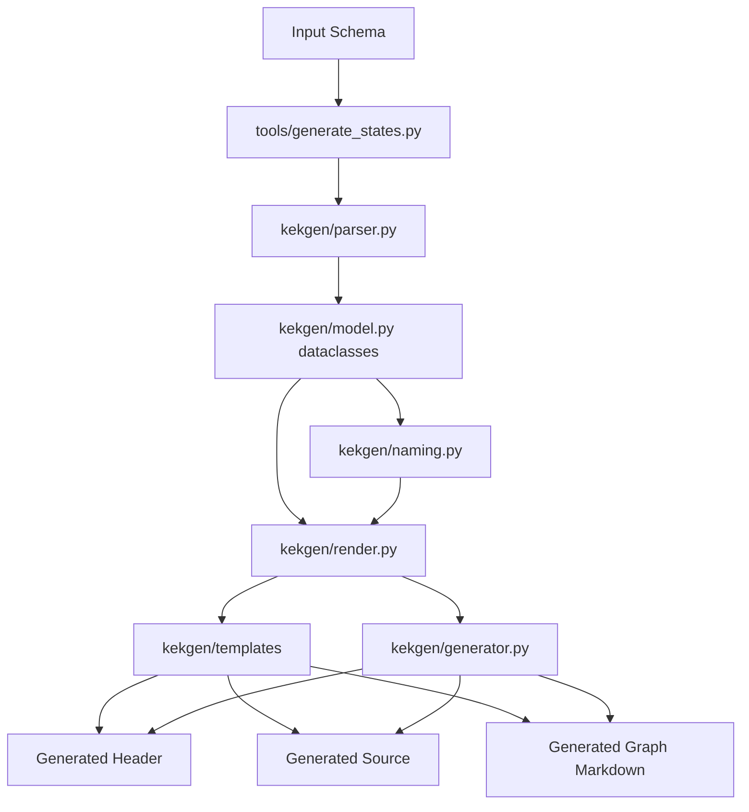
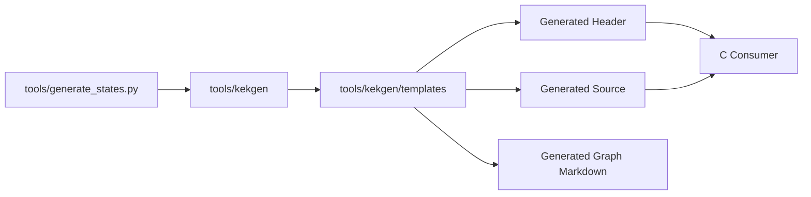

# Generator Architecture

Related documents:

- [Generator Requirements](requirements.md)
- [Generator Specification](specification.md)
- [Runtime Architecture](../runtime/architecture.md)

## Overview

The generator keeps the command-line entry point in `tools/generate_states.py`, while the implementation lives in the `tools/kekgen/` package. The package separates schema modeling, parsing, naming, rendering, filesystem output, and generated-file templates.

`tools/generate_states.py` re-exports the historical public functions such as `parse_source()`, `emit_header()`, `emit_source()`, and `emit_graph()` so the local editor can keep importing `generate_states`.

## Package Layout

| Path | Responsibility |
| --- | --- |
| `tools/generate_states.py` | CLI wrapper and compatibility import surface. |
| `tools/kekgen/model.py` | `Field`, `State`, `Constructor`, `Instance`, and `Hook` dataclasses. |
| `tools/kekgen/parser.py` | JSON parsing and semantic validation. |
| `tools/kekgen/naming.py` | Identifier validation and generated C naming rules. |
| `tools/kekgen/render.py` | Rendering helpers that turn models into template variables. |
| `tools/kekgen/generator.py` | High-level render/write helpers shared by CLI and editor. |
| `tools/kekgen/templates/` | Header, source, and graph template files. |
| `tools/kekgen/standard_states.py` | Editor-facing standard state presets. |

## Internal Model

The generator uses six dataclasses:

| Type | Responsibility |
| --- | --- |
| `Enum` | Stores enum type name and ordered enum values. |
| `Field` | Stores field name, schema type name, default value, optional min/max constraints, and optional fixed array length. |
| `State` | Stores state name, fields, and additional constructors. |
| `Constructor` | Stores a constructor name plus partial field override values. |
| `Instance` | Stores a named initial `KekStateStore` slot declaration. |
| `Hook` | Stores hook trigger plus read/write state dependencies. |

This model is intentionally close to the schema structure. There is no full AST.

## Parsing Strategy

Parsing uses Python's JSON parser and then validates the resulting document into the internal model.

The parser validates:

- Identifier syntax for states, fields, constructors, and hooks.
- Identifier syntax for enum names and enum values.
- That enum declarations are non-empty and unique.
- That each state has one or more fields.
- That each field has a default value.
- That array field lengths are positive and array defaults match the declared length.
- That enum defaults and constructor overrides reference declared enum values.
- That constructor values reference known fields.
- That hooks reference known states.

This keeps source parsing small and leaves room for a JSON Schema file later.

## Emission Strategy

The header, source, and graph emitters render strings from the `State` and `Hook` models using template files for the outer generated-file structure.

The header template owns boilerplate includes, the include guard shape, runtime includes, and declaration section placement. The renderer supplies schema enum declarations, generated state enum text, state declarations, instance declarations, and hook declarations.

The source template owns file-level boilerplate, string helper implementations, descriptor helper placement, and hook descriptor placement. The renderer supplies per-state functions, descriptor entries, instance helpers, hook dependency arrays, and the hook descriptor table.

Generated runtime binding helpers are emitted beside the instance helpers. They do not own `KekRuntime`; they only bind a caller-owned runtime to generated `KekStateStore` slots and generated hook descriptors.

The graph template owns the Markdown and Mermaid shell. The renderer supplies state nodes, hook nodes, trigger edges, read edges, and write edges.

This keeps generated-file layout readable without hiding model-dependent C snippets in a template language.

## Naming Strategy

| Generated Name | Rule |
| --- | --- |
| Header guard | Uppercase output base name with non-alphanumeric characters replaced by `_`, prefixed by `GENERATED_`, suffixed by `_H`. |
| State functions | `<StateName>_default`, `<StateName>_check`, and `<StateName>_reset`. |
| Additional constructors | `<StateName>_<constructorName>`. |
| Descriptor adapters | `<StateName>_default_into`, `<StateName>_check_void`, and `<StateName>_reset_void`. |

## Dependency Direction

Generated structs and state helpers remain plain C data ABI. Generated descriptor declarations explicitly depend on the runtime `KekStateDescriptor` type so runtime state slots can be registered without handwritten adapters.

## Design Constraints

- The parser currently validates JSON directly in Python; a JSON Schema file can be added later.
- Generated state data is plain C.
- Generated min/max constraints are exposed through non-aborting check functions.
- Generated arrays are fixed-size C arrays owned inline by their containing struct.
- Generated schema enums are plain C enum typedefs.
- Generated strings are borrowed views.
- Generated code is expected to be replaceable as the language matures.
