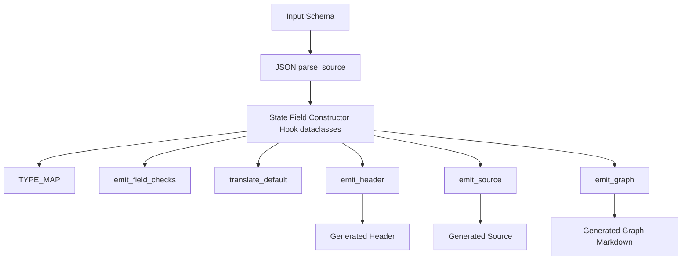
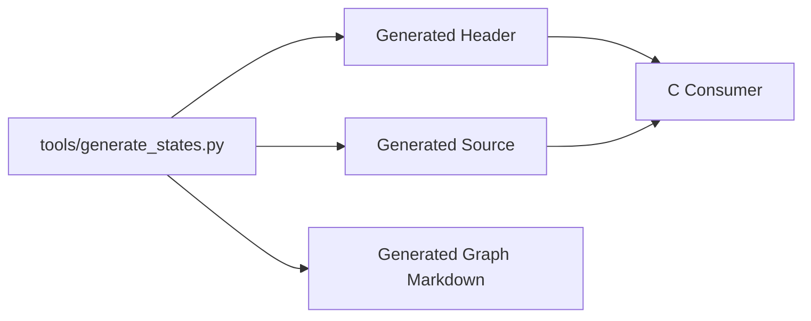

# Generator Architecture

Related documents:

- [Generator Requirements](requirements.md)
- [Generator Specification](specification.md)
- [Runtime Architecture](../runtime/architecture.md)

## Overview

The generator is a single Python script that performs parsing, validation, in-memory modeling, C emission, and Mermaid graph emission for states and hook metadata.

## Internal Model

The generator uses four dataclasses:

| Type | Responsibility |
| --- | --- |
| `Field` | Stores field name, schema type name, default value, and optional min/max constraints. |
| `State` | Stores state name, fields, and additional constructors. |
| `Constructor` | Stores a constructor name plus partial field override values. |
| `Hook` | Stores hook trigger plus read/write state dependencies. |

This model is intentionally close to the schema structure. There is no full AST.

## Parsing Strategy

Parsing uses Python's JSON parser and then validates the resulting document into the internal model.

The parser validates:

- Identifier syntax for states, fields, constructors, and hooks.
- That each state has one or more fields.
- That each field has a default value.
- That constructor values reference known fields.
- That hooks reference known states.

This keeps source parsing small and leaves room for a JSON Schema file later.

## Emission Strategy

The header, source, and graph emitters render strings from the `State` and `Hook` models.

The header emitter owns declarations and aggregate type layout.

The source emitter owns helper implementations, default construction, additional constructors, field constraint checks, void-pointer adapters, state descriptor tables, and hook descriptor tables.

The graph emitter owns documentation-only Markdown containing a Mermaid flowchart of state nodes, hook nodes, trigger edges, read edges, and write edges.

## Naming Strategy

| Generated Name | Rule |
| --- | --- |
| Header guard | Uppercase output base name with non-alphanumeric characters replaced by `_`, prefixed by `GENERATED_`, suffixed by `_H`. |
| Aggregate state | Output base name with first character uppercased, suffixed by `State`. |
| Aggregate fields | State type names converted from CamelCase to snake_case. |
| State functions | `<StateName>_default`, `<StateName>_check`, and `<StateName>_reset`. |
| Additional constructors | `<StateName>_<constructorName>`. |
| Descriptor adapters | `<StateName>_default_into`, `<StateName>_check_void`, and `<StateName>_reset_void`. |

## Dependency Direction

Generated structs and state helpers remain plain C data ABI. Generated descriptor declarations explicitly depend on the runtime `KekStateDescriptor` type so runtime state slots can be registered without handwritten adapters.

## Design Constraints

- The parser currently validates JSON directly in Python; a JSON Schema file can be added later.
- Generated state data is plain C.
- Generated min/max constraints are exposed through non-aborting check functions.
- Generated strings are borrowed views.
- Generated code is expected to be replaceable as the language matures.
