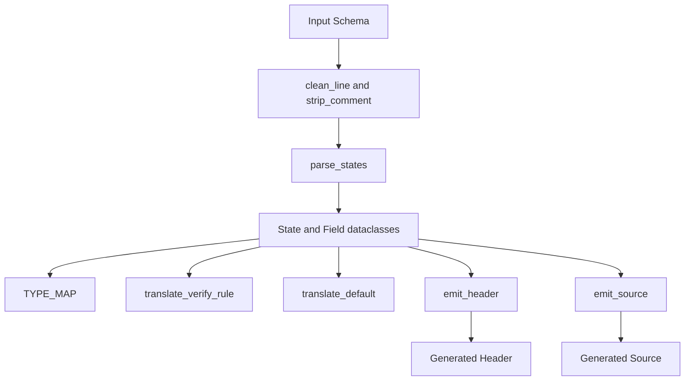
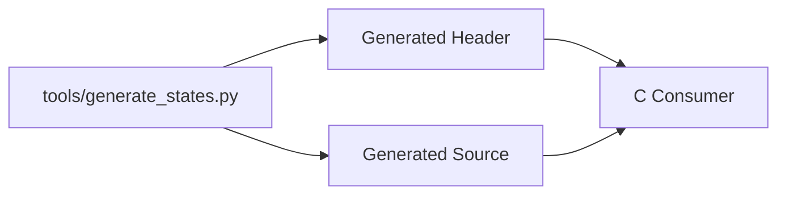

# Generator Architecture

Related documents:

- [Generator Requirements](requirements.md)
- [Generator Specification](specification.md)
- [Runtime Architecture](../runtime/architecture.md)

## Overview

The generator is a single Python script that performs parsing, validation, in-memory modeling, and C emission.

## Internal Model

The generator uses two dataclasses:

| Type | Responsibility |
| --- | --- |
| `Field` | Stores field name and schema type name. |
| `State` | Stores state name, fields, defaults, and verification rules. |

This model is intentionally close to the schema structure. There is no full AST.

## Parsing Strategy

Parsing is line-oriented and stateful.

The parser tracks:

- Current state or no active state.
- Current section: fields, default block, or verify block.
- Brace depth for state/block termination.

This keeps the parser small but limits expression and nesting support.

## Emission Strategy

The header and source emitters render strings from the `State` model.

The header emitter owns declarations and aggregate type layout.

The source emitter owns helper implementations, default construction, and verification code.

## Naming Strategy

| Generated Name | Rule |
| --- | --- |
| Header guard | Uppercase output base name with non-alphanumeric characters replaced by `_`, prefixed by `GENERATED_`, suffixed by `_H`. |
| Aggregate state | Output base name with first character uppercased, suffixed by `State`. |
| Aggregate fields | State type names converted from CamelCase to snake_case. |
| State functions | `<StateName>_default` and `<StateName>_verify`. |

## Dependency Direction

The generator has no dependency on the runtime implementation. Runtime or application code may depend on generated files.

## Design Constraints

- The parser is intentionally not a full language parser.
- Generated state data is plain C.
- Generated verification uses `assert(...)`.
- Generated strings are borrowed views.
- Generated code is expected to be replaceable as the language matures.
