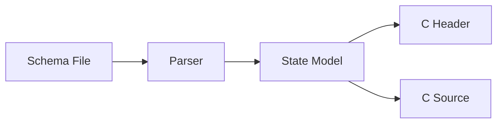

# Generator Requirements

Related documents:

- [Generator Specification](specification.md)
- [Generator Architecture](architecture.md)
- [Runtime Requirements](../runtime/requirements.md)

## Scope

The generator converts a restricted `.kek` state schema into plain C header and source files.

It is responsible for data shape generation, default constructors, and invariant verification helpers. It is not responsible for runtime event handling or application behavior.

## Functional Requirements

| ID | Requirement | Current Status | Evidence |
| --- | --- | --- | --- |
| GEN-FR-001 | Parse `.kek` files containing `state` declarations. | Implemented | `tools/generate_states.py` |
| GEN-FR-002 | Parse typed fields written as `name: Type`. | Implemented | `parse_states()` |
| GEN-FR-003 | Reject duplicate fields in one state. | Implemented | `parse_states()` |
| GEN-FR-004 | Support `default` blocks for initial state values. | Implemented | `State.defaults` |
| GEN-FR-005 | Support `verify` blocks for simple invariants. | Implemented | `State.verify_rules` |
| GEN-FR-006 | Generate C structs for each state. | Implemented | `emit_header()` |
| GEN-FR-007 | Generate one default constructor per state. | Implemented | `emit_source()` |
| GEN-FR-008 | Generate one verification function per state. | Implemented | `emit_source()` |
| GEN-FR-009 | Generate an aggregate state struct for all parsed states. | Implemented | `aggregate_state_name()` |
| GEN-FR-010 | Generate aggregate default and verification functions. | Implemented | `emit_source()` |
| GEN-FR-011 | Map known schema primitive types to C types. | Implemented | `TYPE_MAP` |
| GEN-FR-012 | Preserve unknown type names in generated C. | Implemented | `c_type()` |
| GEN-FR-013 | Provide a command-line interface for input path, output directory, and output base name. | Implemented | `argparse` in `main()` |

## Non-Functional Requirements

| ID | Requirement | Current Status | Evidence |
| --- | --- | --- | --- |
| GEN-NFR-001 | Emit plain C ABI files. | Implemented | generated `.h` and `.c` |
| GEN-NFR-002 | Avoid hidden runtime dependencies in generated code. | Implemented | generated code uses C standard headers and generated declarations |
| GEN-NFR-003 | Keep generated string representation minimal. | Implemented | `KekString` contains `const char*` and `size_t` |
| GEN-NFR-004 | Fail generation with a diagnostic on syntax or validation errors. | Implemented | `except (SyntaxError, ValueError)` |

## Out Of Scope

- Full language parsing.
- Function body compilation.
- Transition body compilation.
- Hook body compilation.
- Runtime registration of generated states.
- Rollback semantics.
- String ownership and allocation policy.

## Requirement Relationship

