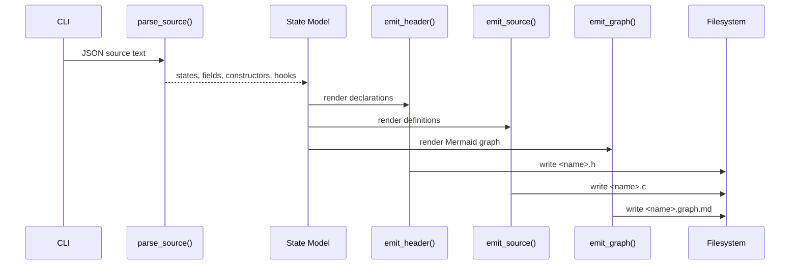

# Generator Specification

Related documents:

- [Generator Requirements](requirements.md)
- [Generator Architecture](architecture.md)
- [Runtime Specification](../runtime/specification.md)

## Command Interface

The generator entry point is:

```sh
python3 tools/generate_states.py <input> --out-dir <directory> --name <base-name>
```

Arguments:

| Argument | Required | Default | Meaning |
| --- | --- | --- | --- |
| `input` | Yes | none | Input JSON schema file. |
| `--out-dir` | No | `generated` | Destination directory for generated files. |
| `--name` | No | input file basename | Base name for generated `.h` and `.c` files. |

The generator creates the output directory when it does not exist.

Generated files:

| File | Meaning |
| --- | --- |
| `<name>.h` | C declarations for generated states and hook metadata. |
| `<name>.c` | C definitions for generated states and hook metadata. |
| `<name>.graph.md` | Markdown document containing a Mermaid graph of states and hook dependencies. |

## JSON Schema Subset

The supported schema root is a JSON object:

```json
{
  "version": 1,
  "states": [
    {
      "name": "Player",
      "fields": [
        {
          "name": "health",
          "type": "i32",
          "default": 100,
          "min": 0,
          "max": 100
        }
      ],
      "constructors": [
        {
          "name": "dead",
          "values": {
            "health": 0
          }
        }
      ]
    }
  ],
  "hooks": [
    {
      "name": "HandleInputChanged",
      "on": {
        "state": "StandardInput",
        "event": "changed"
      },
      "reads": ["StandardInput"],
      "writes": ["Player"]
    }
  ]
}
```

Parser rules:

- State names must match `[A-Za-z_][A-Za-z0-9_]*`.
- Each state must contain one or more fields.
- Field names must match `[A-Za-z_][A-Za-z0-9_]*`.
- Field type names must match `[A-Za-z_][A-Za-z0-9_]*`.
- Each field must declare a `default` value.
- Optional field `min` and `max` values generate verification checks.
- For `String` fields, `min` and `max` constrain string length.
- Constructor names must match `[A-Za-z_][A-Za-z0-9_]*` and must not be `default`.
- Additional constructors are partial overrides layered on top of the default constructor.
- Hook names and referenced state names must use identifiers.
- Hook triggers currently support `{ "event": "changed" }`.

## Type Mapping

| Schema Type | C Type |
| --- | --- |
| `String` | `KekString` |
| `bool` | `bool` |
| `i32` | `int32_t` |
| `i64` | `int64_t` |
| `u32` | `uint32_t` |
| `u64` | `uint64_t` |
| `f32` | `float` |
| `f64` | `double` |

Unknown type names are emitted unchanged.

## Generated Header

The generated header contains:

- Include guard derived from the output base name.
- C standard includes for `bool`, `size_t`, and fixed-width integer types.
- `KekString` declaration.
- `kek_string_from_cstr()` declaration.
- `kek_string_len()` declaration.
- One C struct per schema state.
- One default function declaration per state.
- One function declaration for each additional state constructor.
- One non-aborting check function declaration per state.
- One reset function declaration per state.
- One aggregate state struct containing all states.
- Aggregate default, check, and reset function declarations.
- A generated state type enum.
- Void-pointer adapter declarations for descriptor use.
- A generated `KekStateDescriptor` table declaration.
- Generated hook function declarations.
- A generated hook descriptor table declaration.

State names are preserved. Aggregate field names are derived from state names by converting CamelCase to snake_case.

## Generated Source

The generated source contains:

- `KekString` helper implementations.
- Per-state default constructors.
- Per-state additional constructors.
- Per-state non-aborting check functions.
- Per-state reset functions.
- Aggregate default constructor.
- Aggregate check function.
- Aggregate reset function.
- Void-pointer descriptor adapters.
- A generated descriptor table.
- Generated hook read/write dependency arrays.
- A generated hook descriptor table.

Default constructors zero-initialize the state first and then assign every field default.

Additional constructors call the default constructor first and then assign their partial override values.

Check functions return `0` when the state pointer is null or any generated `min`/`max` constraint fails. They return `1` when all constraints pass.

Reset functions return `0` when the state pointer is null. Otherwise, they assign the corresponding default value into the existing object and return the result of the corresponding check function.

Generated structs expose their fields directly. Callers that need rollback-safe validation should update through `KekStateStorage`, which validates the complete draft before swapping it into place.

Generated hook descriptors reference user-provided C hook bodies by name. The generator does not compile hook bodies.

## Generated Graph

The generated graph file is a Markdown document containing one Mermaid `flowchart LR` block.

Graph nodes:

- Each schema state is emitted as a state node.
- Each hook is emitted as a hook node.

Graph edges:

- `State --> Hook` labeled `changed` for the hook trigger declared by `on.state` and `event: changed`.
- `State -.-> Hook` labeled `reads` for every state listed in `reads`.
- `Hook --> State` labeled `writes` for every state listed in `writes`.

The graph is documentation-only and does not affect generated C ABI or runtime behavior.

## Generated String ABI

```c
typedef struct KekString {
    const char* data;
    size_t len;
} KekString;
```

`KekString` is a borrowed string view. The generator does not allocate, copy, or free string data.

## Error Handling

On parse or validation failure, the generator prints a diagnostic to stderr and exits with status `1`.

On success, it writes the generated header, source, and graph files and prints their paths.

## Generation Flow


