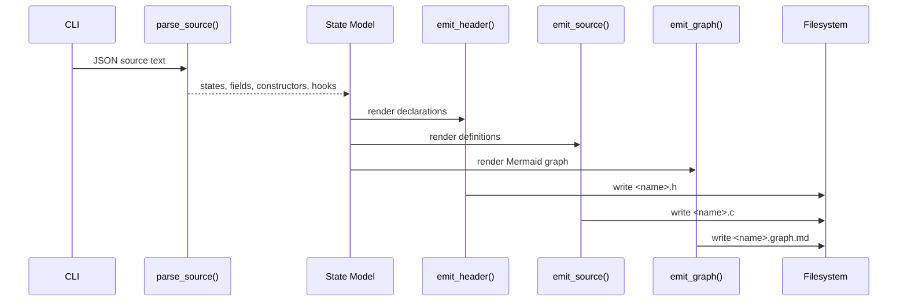

# Generator Specification

Related documents:

- [Generator Requirements](requirements.md)
- [Generator Architecture](architecture.md)
- [Runtime Specification](../runtime/specification.md)

## Command Interface

The generator entry point is:

```sh
python3 tools/generate_states.py <input> --out-dir <directory> --name <base-name>
```

Arguments:

| Argument | Required | Default | Meaning |
| --- | --- | --- | --- |
| `input` | Yes | none | Input JSON schema file. |
| `--out-dir` | No | `generated` | Destination directory for generated files. |
| `--name` | No | input file basename | Base name for generated `.h` and `.c` files. |
| `--hooks-dir` | No | none | Optional destination directory for a generated hook API header and one C stub per hook. |

The generator creates the output directory when it does not exist.

Generated files:

| File | Meaning |
| --- | --- |
| `<name>.h` | C declarations for generated states and hook metadata. |
| `<name>.c` | C definitions for generated states and hook metadata. |
| `<name>.graph.md` | Markdown document containing a Mermaid graph of states and hook dependencies. |
| `<hooks-dir>/<name>_hooks.h` | Optional generated hook API header. |
| `<hooks-dir>/<hook-name>.c` | Optional generated hook implementation stub, created only when missing. |

## JSON Schema Subset

The supported schema root is a JSON object:

```json
{
  "version": 1,
  "enums": [
    {
      "name": "Direction",
      "values": ["None", "North", "South", "West", "East"]
    }
  ],
  "states": [
    {
      "name": "standard_input",
      "type": "StandardInput",
      "config": { "buffer_size": 4096 }
    },
    {
      "name": "standard_output",
      "type": "StandardOutput",
      "config": { "buffer_size": 4096 }
    },
    {
      "name": "timer",
      "type": "Timer",
      "values": { "interval_ms": 1000, "enabled": true }
    },
    {
      "name": "Player",
      "fields": [
        {
          "name": "last_direction",
          "type": "Direction",
          "default": "None"
        },
        {
          "name": "health",
          "type": "i32",
          "default": 100,
          "min": 0,
          "max": 100
        },
        {
          "name": "recent_damage",
          "type": "i32",
          "array": 3,
          "default": [0, 0, 0],
          "min": 0
        }
      ],
      "constructors": [
        {
          "name": "dead",
          "values": {
            "health": 0
          }
        }
      ]
    }
  ],
  "instances": [
    {
      "name": "player",
      "state": "Player"
    }
  ],
  "hooks": [
    {
      "name": "HandleInputChanged",
      "on": {
        "instance": "standard_input",
        "event": "changed"
      },
      "reads": ["StandardInput"],
      "writes": ["Player"]
    }
  ]
}
```

Parser rules:

- Optional root-level `enums` declare named enum types.
- Enum names and values must match `[A-Za-z_][A-Za-z0-9_]*`.
- Enum declarations must contain one or more values.
- Enum field defaults and constructor overrides are strings that must match a declared enum value.
- State names must match `[A-Za-z_][A-Za-z0-9_]*`.
- Entries in `states` either define a state type with `fields` or declare a named state slot with `type`.
- A typed state slot can reference standard types `StandardInput`, `StandardOutput`, and `Timer` without repeating their fields.
- Typed state slots may use `values` to override initial field values for that slot.
- `StandardInput` and `StandardOutput` support `config.buffer_size`, which sets the generated String `max` constraint and generated binding buffer size for their text field.
- `Timer` interval and enablement are configured through `values.interval_ms` and `values.enabled`.
- `StandardInput` and `StandardOutput` may only be declared once. `Timer` may be declared multiple times.
- Each custom state type must contain one or more fields.
- Field names must match `[A-Za-z_][A-Za-z0-9_]*`.
- Field type names must match `[A-Za-z_][A-Za-z0-9_]*`.
- Each field must declare a `default` value.
- Optional field `array` declares a fixed-size C array and must be a positive integer.
- Array field defaults and constructor overrides must be JSON arrays with exactly `array` values.
- Optional field `min` and `max` values generate verification checks.
- For `String` fields, `min` and `max` constrain string length.
- For array fields, `min` and `max` checks apply to every array element.
- Constructor names must match `[A-Za-z_][A-Za-z0-9_]*` and must not be `default`.
- Additional constructors are partial overrides layered on top of the default constructor.
- Hook names and referenced state names must use identifiers.
- Hook triggers support `{ "event": "changed" }`, `{ "event": "created" }`, and `{ "event": "deleted" }`.
- Hook triggers must declare exactly one selector: `state` for all instances of a state type, or `instance` for one schema-declared named slot.
- Hook triggers may include `fields`, an array of field names from the triggering state. When provided, the generated hook only runs for changed events whose field mask contains at least one listed field.
- Hooks may include optional `access` metadata with `reads`, `writes`, `creates`, and `deletes` arrays. Each access entry declares exactly one of `instance` or `state`; state entries may set `scope` to `any`, `declared`, or `dynamic`; entries may set `fields` to a field-name array. When present, `access` is the runtime scheduler authority while legacy `reads` and `writes` remain generated for compatibility and broad write authorization fallback.
- `access.mode: "opaque"` or `access.opaque: true` forces serial hook scheduling. `access.field_merge_safe: true` opts a hook into same-slot disjoint-field write merging when the runtime can prove field masks do not overlap.
- Optional root-level `instances` declare named initial `KekStateStore` slots.
- Instance names must match `[A-Za-z_][A-Za-z0-9_]*`.
- Instance `state` values must reference a declared state type.
- Optional instance `constructor` values must reference an additional constructor on that state type.

## Type Mapping

| Schema Type | C Type |
| --- | --- |
| `String` | `KekString` |
| `bool` | `bool` |
| `i32` | `int32_t` |
| `i64` | `int64_t` |
| `u32` | `uint32_t` |
| `u64` | `uint64_t` |
| `f32` | `float` |
| `f64` | `double` |

Unknown type names are emitted unchanged.

Declared enum type names map to generated C enum types of the same name. Enum values are emitted as `<EnumName>_<ValueName>`. For example, schema value `"North"` in enum `Direction` becomes `Direction_North` in generated C.

Fixed-size arrays append the declared length to the generated C field. For example, `{ "name": "cells", "type": "i32", "array": 4, "default": [0, 0, 0, 0] }` emits `int32_t cells[4];`.

## Generated Header

The generated header contains:

- Include guard derived from the output base name.
- C standard includes for `bool`, `size_t`, and fixed-width integer types.
- `KekString` declaration.
- `kek_string_from_cstr()` declaration.
- `kek_string_len()` declaration.
- One C enum typedef per schema enum.
- One C struct per schema state.
- One default function declaration per state.
- One function declaration for each additional state constructor.
- One non-aborting check function declaration per state.
- One reset function declaration per state.
- A generated state type enum.
- Void-pointer adapter declarations for descriptor use.
- A generated `KekStateDescriptor` table declaration.
- A generated helper for adding one default `KekStateStore` slot per generated state type.
- A generated named slot struct and helpers for adding/removing/resetting schema-declared instances in `KekStateStore`.
- A generated runtime binding struct that owns `KekStateStore`, `KekHookRegistry`, and declared slot ids for a caller-owned `KekRuntime`.
- A generated runtime wrapper that owns the low-level runtime app, generated declared slots, generated hook descriptors, and any generated string backing buffers.
- Generated runtime-wrapper accessors for the underlying `KekRuntime`, `KekStateStore`, declared slots, event dispatch, and named declared-instance reads.
- Generated per-state create/create-with-initial/delete/find helpers for dynamic instances, both for raw `KekStateStore` callers and generated runtime-wrapper callers.
- Generated typed accessors for named instances and arbitrary slot ids.
- A generated `<Name>UpdateItem` batch item alias plus generated update helpers, update-item builders, count helpers, declared-slot predicates, and scalar field setters so application code does not need to stitch together store pointers and slot ids for common operations.
- Generated string-field setter helpers for single-string states, useful for standard input/output bridge code.
- Generated hook function declarations.
- A generated hook descriptor table declaration.

State names are preserved. Generated state type macros are derived from state names by converting CamelCase to uppercase snake case. For example, `StandardInput` becomes `KEK_STATE_TYPE_STANDARD_INPUT` in the enum.

Generated headers include runtime headers as `runtime/...`, so generated output can live in project-local directories when the compiler include path points at the repository root.

## Generated Source

The generated source contains:

- `KekString` helper implementations.
- Per-state default constructors.
- Per-state additional constructors.
- Per-state non-aborting check functions.
- Per-state reset functions.
- Void-pointer descriptor adapters.
- A generated descriptor table.
- A generated default slot registration helper.
- A generated declared-slot reset helper backed by `kek_state_store_update_many()`.
- Generated hook read/write dependency arrays.
- Generated hook access descriptor arrays for precise scheduling, with named-instance access slots patched during generated runtime binding initialization.
- A generated hook descriptor table.

Default constructors zero-initialize the state first and then assign every field default. Array fields are assigned element-by-element from the declared default array.

Additional constructors call the default constructor first and then assign their partial override values. Array overrides replace the whole generated array element-by-element.

Check functions return `0` when the state pointer is null or any generated `min`/`max` constraint fails. They return `1` when all constraints pass.

Reset functions return `0` when the state pointer is null. Otherwise, they assign the corresponding default value into the existing object and return the result of the corresponding check function.

Generated structs expose their fields directly. Callers that need rollback-safe validation should update through `KekStateStore` or `KekStateStorage`, which validate the complete draft before swapping it into place.

Each generated state field has a bitmask macro named `<STATE_TYPE_MACRO>_FIELD_<FIELD_NAME>`, used in state-change events and generated hook field filters.

Each generated state descriptor includes a generated field-merge helper. The runtime uses this helper only for opt-in same-slot parallel write merging, copying the fields identified by a generated field mask from a worker result into the live state draft.

`kek_generated_state_store_add_defaults()` adds one default-initialized slot for each generated state type and writes the created slot ids into a caller-provided `size_t slot_ids[KEK_STATE_TYPE_COUNT]` array.

`<name>_state_slots_add_declared()` adds the schema-declared instances to `KekStateStore` and writes their slot ids into the generated `<Name>StateSlots` struct. The slot struct stores only ids; `KekStateStore` remains the source of truth for all instance data.

`<name>_state_slots_reset_declared()` resets all currently declared slots through one transactional batch update.

Generated `<name>_<state>_create()` and `<name>_<state>_create_with()` helpers create dynamic instances through `KekStateStore`. The `create_with` variant accepts an already initialized state value and publishes only the created event for that initialized value. Generated `<name>_<state>_delete()` helpers delete dynamic instances.

`<name>_runtime_init()` is the recommended application-facing lifecycle helper. It initializes a generated `<Name>Runtime` object that owns a `KekRuntimeApp`, adds declared instances, resolves declared-instance hook slot ids, registers generated hook descriptors, and attaches the hook registry. `<name>_runtime_destroy()` detaches hooks, destroys the generated store, destroys the runtime, and clears the wrapper object.

`<name>_get_runtime()`, `<name>_get_store()`, `<name>_get_slots()`, and const variants expose the wrapper internals for integrations that still need low-level runtime, store, or slot APIs. `<name>_dispatch()` dispatches pending runtime events for host loops that drive their own frame lifecycle.

For batch updates, the generator emits `<Name>UpdateItem` as the generated-project-facing alias for runtime store update items, plus `<name>_update_many()`.

For each state, the generator emits runtime-scoped helpers named `<name>_create_<state>()`, `<name>_create_<state>_with()`, `<name>_delete_<state>()`, `<name>_<state>_at()`, `<name>_<state>_at_const()`, `<name>_first_<state>()`, `<name>_next_<state>()`, `<name>_count_<state>()`, `<name>_update_<state>_slot()`, and `<name>_<state>_slot_update_item()`. For states with a scalar `bool active` field, it also emits `<name>_count_active_<state>()`.

For each declared instance, the generator emits `<name>_<instance>_current()`, `<name>_<instance>_current_const()`, `<name>_<instance>_slot_id()`, `<name>_update_<instance>()`, and `<name>_<instance>_update_item()` helpers. These are convenience wrappers around the generated typed slot accessors and the runtime wrapper's declared slot table. When a state has multiple named instances, the generator also emits `<name>_is_declared_<state>_slot()` predicates for filtering dynamic slots.

For scalar non-`String` fields, the generator emits raw-store setters named `<name>_<state>_set_<field>()`, runtime-scoped arbitrary-slot setters named `<name>_set_<state>_slot_<field>()`, and declared-instance setters named `<name>_set_<instance>_<field>()`. Existing generated `String` setters keep their string-specific `(data, len)` API.

`<name>_runtime_binding_init()` remains available for advanced callers that own a separate `KekRuntime`. It initializes the state store, adds declared instances, registers generated hook descriptors, and attaches the hook registry. `<name>_runtime_binding_destroy()` detaches hooks and destroys the generated state store.

For generated states with exactly one `String` field, `<name>_<state>_set_<field>()` updates that field through `KekStateStore`, preserving validation and change-event publication.

Generated hook descriptors reference user-provided C hook bodies by name. The generator does not compile hook bodies.

When `--hooks-dir` is provided, the generator writes `<name>_hooks.h` and creates one editable hook stub C file per schema hook. Existing hook C files are not overwritten. The generated hook header is replaced on each generation pass so declarations stay aligned with the schema.

When generated code is compiled with `KEK_HOOK_DYNAMIC`, hook descriptor `.run` fields are emitted as null pointers instead of direct references to hook symbols. This lets the main executable compile without statically linking hook implementations; the runtime debug loader resolves each hook by descriptor name from a dynamic library.

## Generated Graph

The generated graph file is a Markdown document containing one Mermaid `flowchart LR` block.

Graph nodes:

- Each schema state is emitted as a state node.
- Each hook is emitted as a hook node.

Graph edges:

- `State --> Hook` for state-wide hook triggers declared by `on.state`.
- `Instance --> Hook` for instance-specific hook triggers declared by `on.instance`.
- `State -.-> Hook` labeled `reads` for every state listed in `reads`.
- `Hook --> State` labeled `writes` for every state listed in `writes`.

The graph is documentation-only and does not affect generated C ABI or runtime behavior.

## Generated String ABI

```c
typedef struct KekString {
    const char* data;
    size_t len;
} KekString;
```

`KekString` is a borrowed string view. The generator does not allocate, copy, or free string data.

## Error Handling

On parse or validation failure, the generator prints a diagnostic to stderr and exits with status `1`.

On success, it writes the generated header, source, and graph files and prints their paths.

## Generation Flow


