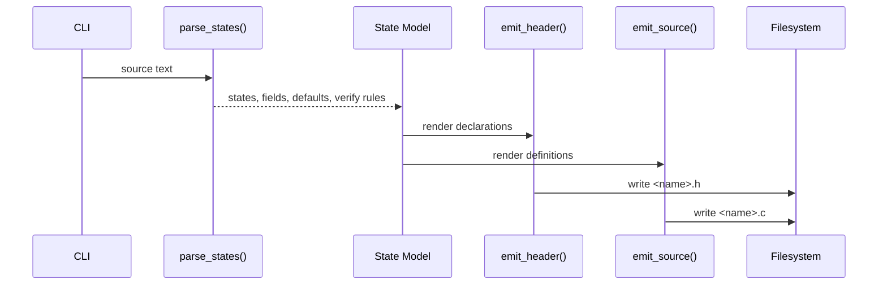

# Generator Specification

Related documents:

- [Generator Requirements](requirements.md)
- [Generator Architecture](architecture.md)
- [Runtime Specification](../runtime/specification.md)

## Command Interface

The generator entry point is:

```sh
python3 tools/generate_states.py <input> --out-dir <directory> --name <base-name>
```

Arguments:

| Argument | Required | Default | Meaning |
| --- | --- | --- | --- |
| `input` | Yes | none | Input `.kek` schema file. |
| `--out-dir` | No | `generated` | Destination directory for generated files. |
| `--name` | No | input file basename | Base name for generated `.h` and `.c` files. |

The generator creates the output directory when it does not exist.

## Schema Grammar Subset

The supported schema unit is a `state` declaration:

```text
state StateName {
  fieldName: TypeName

  default {
    fieldName: value
  }

  verify {
    expression
  }
}
```

The supported hook declaration is:

```text
hook HookName {
  on StateName.changed
  reads StateA, StateB
  writes StateC
}
```

Parser rules:

- State names must match `[A-Za-z_][A-Za-z0-9_]*`.
- Field names must match `[A-Za-z_][A-Za-z0-9_]*`.
- Field type names must match `[A-Za-z_][A-Za-z0-9_]*`.
- Field declarations use `name: Type`.
- Default assignments use `name: value` or `name = value`.
- Commas and semicolons are accepted as optional line endings.
- `//` comments are ignored unless inside a string literal.
- Nested states and nested blocks are rejected.
- Hook names and referenced state names must use identifiers.
- Hook triggers currently support `StateName.changed`.

## Type Mapping

| Schema Type | C Type |
| --- | --- |
| `String` | `KekString` |
| `bool` | `bool` |
| `i32` | `int32_t` |
| `i64` | `int64_t` |
| `u32` | `uint32_t` |
| `u64` | `uint64_t` |
| `f32` | `float` |
| `f64` | `double` |

Unknown type names are emitted unchanged.

## Generated Header

The generated header contains:

- Include guard derived from the output base name.
- C standard includes for `bool`, `size_t`, and fixed-width integer types.
- `KekString` declaration.
- `kek_string_from_cstr()` declaration.
- `kek_string_len()` declaration.
- One C struct per schema state.
- One default function declaration per state.
- One non-aborting check function declaration per state.
- One reset function declaration per state.
- One aggregate state struct containing all states.
- Aggregate default, check, and reset function declarations.
- A generated state type enum.
- Void-pointer adapter declarations for descriptor use.
- A generated `KekStateDescriptor` table declaration.
- Generated hook function declarations.
- A generated hook descriptor table declaration.

State names are preserved. Aggregate field names are derived from state names by converting CamelCase to snake_case.

## Generated Source

The generated source contains:

- `KekString` helper implementations.
- Per-state default constructors.
- Per-state non-aborting check functions.
- Per-state reset functions.
- Aggregate default constructor.
- Aggregate check function.
- Aggregate reset function.
- Void-pointer descriptor adapters.
- A generated descriptor table.
- Generated hook read/write dependency arrays.
- A generated hook descriptor table.

Default constructors zero-initialize the state first and then assign explicit defaults.

Check functions return `0` when the state pointer is null or any translated verification rule fails. They return `1` when all rules pass.

Reset functions return `0` when the state pointer is null. Otherwise, they assign the corresponding default value into the existing object and return the result of the corresponding check function.

Generated structs expose their fields directly. Callers that need rollback-safe validation should update through `KekStateStorage`, which validates the complete draft before swapping it into place.

Callers that need independent state instances should use `KekStateStore` with generated `KekStateDescriptor` entries. Multiple runtime slots may use the same descriptor.

Generated hook descriptors reference user-provided C hook bodies by name. The generator does not compile hook bodies.

## Verification Translation

The generator translates verification rules with simple text rewriting:

- `field.len()` on a `String` field becomes `kek_string_len(&state->field)`.
- Known field identifiers become `state->field`.
- `true` and `false` remain unchanged.
- Operators and literals are copied directly.

The generator validates that `.len()` references known `String` fields.

## Generated String ABI

```c
typedef struct KekString {
    const char* data;
    size_t len;
} KekString;
```

`KekString` is a borrowed string view. The generator does not allocate, copy, or free string data.

## Error Handling

On parse or validation failure, the generator prints a diagnostic to stderr and exits with status `1`.

On success, it writes both output files and prints their paths.

## Generation Flow


