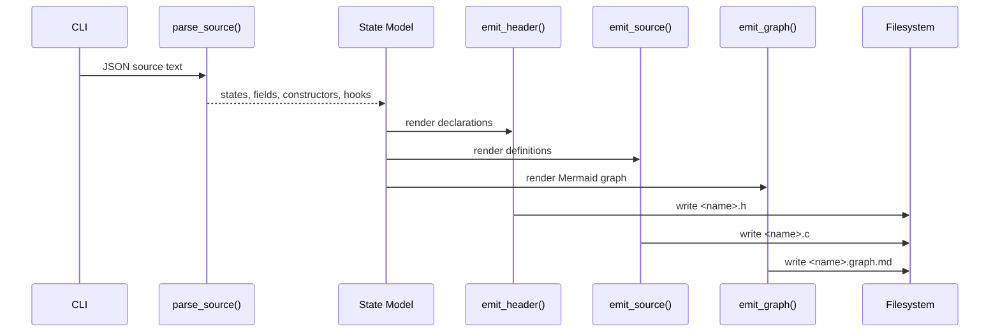

# Generator Specification

Related documents:

- [Generator Requirements](requirements.md)
- [Generator Architecture](architecture.md)
- [Runtime Specification](../runtime/specification.md)

## Command Interface

The generator entry point is:

```sh
python3 tools/generate_states.py <input> --out-dir <directory> --name <base-name>
```

Arguments:

| Argument | Required | Default | Meaning |
| --- | --- | --- | --- |
| `input` | Yes | none | Input JSON schema file. |
| `--out-dir` | No | `generated` | Destination directory for generated files. |
| `--name` | No | input file basename | Base name for generated `.h` and `.c` files. |

The generator creates the output directory when it does not exist.

Generated files:

| File | Meaning |
| --- | --- |
| `<name>.h` | C declarations for generated states and hook metadata. |
| `<name>.c` | C definitions for generated states and hook metadata. |
| `<name>.graph.md` | Markdown document containing a Mermaid graph of states and hook dependencies. |

## JSON Schema Subset

The supported schema root is a JSON object:

```json
{
  "version": 1,
  "enums": [
    {
      "name": "Direction",
      "values": ["None", "North", "South", "West", "East"]
    }
  ],
  "states": [
    {
      "name": "standard_input",
      "type": "StandardInput",
      "config": { "buffer_size": 4096 }
    },
    {
      "name": "standard_output",
      "type": "StandardOutput",
      "config": { "buffer_size": 4096 }
    },
    {
      "name": "timer",
      "type": "Timer",
      "values": { "interval_ms": 1000, "enabled": true }
    },
    {
      "name": "Player",
      "fields": [
        {
          "name": "last_direction",
          "type": "Direction",
          "default": "None"
        },
        {
          "name": "health",
          "type": "i32",
          "default": 100,
          "min": 0,
          "max": 100
        },
        {
          "name": "recent_damage",
          "type": "i32",
          "array": 3,
          "default": [0, 0, 0],
          "min": 0
        }
      ],
      "constructors": [
        {
          "name": "dead",
          "values": {
            "health": 0
          }
        }
      ]
    }
  ],
  "instances": [
    {
      "name": "player",
      "state": "Player"
    }
  ],
  "hooks": [
    {
      "name": "HandleInputChanged",
      "on": {
        "state": "StandardInput",
        "event": "changed"
      },
      "reads": ["StandardInput"],
      "writes": ["Player"]
    }
  ]
}
```

Parser rules:

- Optional root-level `enums` declare named enum types.
- Enum names and values must match `[A-Za-z_][A-Za-z0-9_]*`.
- Enum declarations must contain one or more values.
- Enum field defaults and constructor overrides are strings that must match a declared enum value.
- State names must match `[A-Za-z_][A-Za-z0-9_]*`.
- Entries in `states` either define a state type with `fields` or declare a named state slot with `type`.
- A typed state slot can reference standard types `StandardInput`, `StandardOutput`, and `Timer` without repeating their fields.
- Typed state slots may use `values` to override initial field values for that slot.
- `StandardInput` and `StandardOutput` support `config.buffer_size`, which sets the generated String `max` constraint and generated binding buffer size for their text field.
- `Timer` interval and enablement are configured through `values.interval_ms` and `values.enabled`.
- `StandardInput` and `StandardOutput` may only be declared once. `Timer` may be declared multiple times.
- Each custom state type must contain one or more fields.
- Field names must match `[A-Za-z_][A-Za-z0-9_]*`.
- Field type names must match `[A-Za-z_][A-Za-z0-9_]*`.
- Each field must declare a `default` value.
- Optional field `array` declares a fixed-size C array and must be a positive integer.
- Array field defaults and constructor overrides must be JSON arrays with exactly `array` values.
- Optional field `min` and `max` values generate verification checks.
- For `String` fields, `min` and `max` constrain string length.
- For array fields, `min` and `max` checks apply to every array element.
- Constructor names must match `[A-Za-z_][A-Za-z0-9_]*` and must not be `default`.
- Additional constructors are partial overrides layered on top of the default constructor.
- Hook names and referenced state names must use identifiers.
- Hook triggers currently support `{ "event": "changed" }`.
- Optional root-level `instances` declare named initial `KekStateStore` slots.
- Instance names must match `[A-Za-z_][A-Za-z0-9_]*`.
- Instance `state` values must reference a declared state type.
- Optional instance `constructor` values must reference an additional constructor on that state type.

## Type Mapping

| Schema Type | C Type |
| --- | --- |
| `String` | `KekString` |
| `bool` | `bool` |
| `i32` | `int32_t` |
| `i64` | `int64_t` |
| `u32` | `uint32_t` |
| `u64` | `uint64_t` |
| `f32` | `float` |
| `f64` | `double` |

Unknown type names are emitted unchanged.

Declared enum type names map to generated C enum types of the same name. Enum values are emitted as `<EnumName>_<ValueName>`. For example, schema value `"North"` in enum `Direction` becomes `Direction_North` in generated C.

Fixed-size arrays append the declared length to the generated C field. For example, `{ "name": "cells", "type": "i32", "array": 4, "default": [0, 0, 0, 0] }` emits `int32_t cells[4];`.

## Generated Header

The generated header contains:

- Include guard derived from the output base name.
- C standard includes for `bool`, `size_t`, and fixed-width integer types.
- `KekString` declaration.
- `kek_string_from_cstr()` declaration.
- `kek_string_len()` declaration.
- One C enum typedef per schema enum.
- One C struct per schema state.
- One default function declaration per state.
- One function declaration for each additional state constructor.
- One non-aborting check function declaration per state.
- One reset function declaration per state.
- A generated state type enum.
- Void-pointer adapter declarations for descriptor use.
- A generated `KekStateDescriptor` table declaration.
- A generated helper for adding one default `KekStateStore` slot per generated state type.
- A generated named slot struct and helpers for adding/removing/resetting schema-declared instances in `KekStateStore`.
- A generated runtime binding struct that owns `KekStateStore`, `KekHookRegistry`, and declared slot ids for a caller-owned `KekRuntime`.
- Generated per-state create/delete/find helpers for dynamic instances.
- Generated typed accessors for named instances and arbitrary slot ids.
- Generated string-field setter helpers for single-string states, useful for standard input/output bridge code.
- Generated hook function declarations.
- A generated hook descriptor table declaration.

State names are preserved. Generated state type macros are derived from state names by converting CamelCase to uppercase snake case. For example, `StandardInput` becomes `KEK_STATE_TYPE_STANDARD_INPUT` in the enum.

Generated headers include runtime headers as `runtime/...`, so generated output can live in project-local directories when the compiler include path points at the repository root.

## Generated Source

The generated source contains:

- `KekString` helper implementations.
- Per-state default constructors.
- Per-state additional constructors.
- Per-state non-aborting check functions.
- Per-state reset functions.
- Void-pointer descriptor adapters.
- A generated descriptor table.
- A generated default slot registration helper.
- A generated declared-slot reset helper backed by `kek_state_store_update_many()`.
- Generated hook read/write dependency arrays.
- A generated hook descriptor table.

Default constructors zero-initialize the state first and then assign every field default. Array fields are assigned element-by-element from the declared default array.

Additional constructors call the default constructor first and then assign their partial override values. Array overrides replace the whole generated array element-by-element.

Check functions return `0` when the state pointer is null or any generated `min`/`max` constraint fails. They return `1` when all constraints pass.

Reset functions return `0` when the state pointer is null. Otherwise, they assign the corresponding default value into the existing object and return the result of the corresponding check function.

Generated structs expose their fields directly. Callers that need rollback-safe validation should update through `KekStateStore` or `KekStateStorage`, which validate the complete draft before swapping it into place.

`kek_generated_state_store_add_defaults()` adds one default-initialized slot for each generated state type and writes the created slot ids into a caller-provided `size_t slot_ids[KEK_STATE_TYPE_COUNT]` array.

`<name>_state_slots_add_declared()` adds the schema-declared instances to `KekStateStore` and writes their slot ids into the generated `<Name>StateSlots` struct. The slot struct stores only ids; `KekStateStore` remains the source of truth for all instance data.

`<name>_state_slots_reset_declared()` resets all currently declared slots through one transactional batch update.

Generated `<name>_<state>_create()` and `<name>_<state>_delete()` helpers create and delete dynamic instances through `KekStateStore`.

`<name>_runtime_binding_init()` initializes a generated runtime binding for a caller-owned `KekRuntime`. It initializes the state store, adds declared instances, registers generated hook descriptors, and attaches the hook registry. `<name>_runtime_binding_destroy()` detaches hooks and destroys the generated state store.

For generated states with exactly one `String` field, `<name>_<state>_set_<field>()` updates that field through `KekStateStore`, preserving validation and change-event publication.

Generated hook descriptors reference user-provided C hook bodies by name. The generator does not compile hook bodies.

## Generated Graph

The generated graph file is a Markdown document containing one Mermaid `flowchart LR` block.

Graph nodes:

- Each schema state is emitted as a state node.
- Each hook is emitted as a hook node.

Graph edges:

- `State --> Hook` labeled `changed` for the hook trigger declared by `on.state` and `event: changed`.
- `State -.-> Hook` labeled `reads` for every state listed in `reads`.
- `Hook --> State` labeled `writes` for every state listed in `writes`.

The graph is documentation-only and does not affect generated C ABI or runtime behavior.

## Generated String ABI

```c
typedef struct KekString {
    const char* data;
    size_t len;
} KekString;
```

`KekString` is a borrowed string view. The generator does not allocate, copy, or free string data.

## Error Handling

On parse or validation failure, the generator prints a diagnostic to stderr and exits with status `1`.

On success, it writes the generated header, source, and graph files and prints their paths.

## Generation Flow


