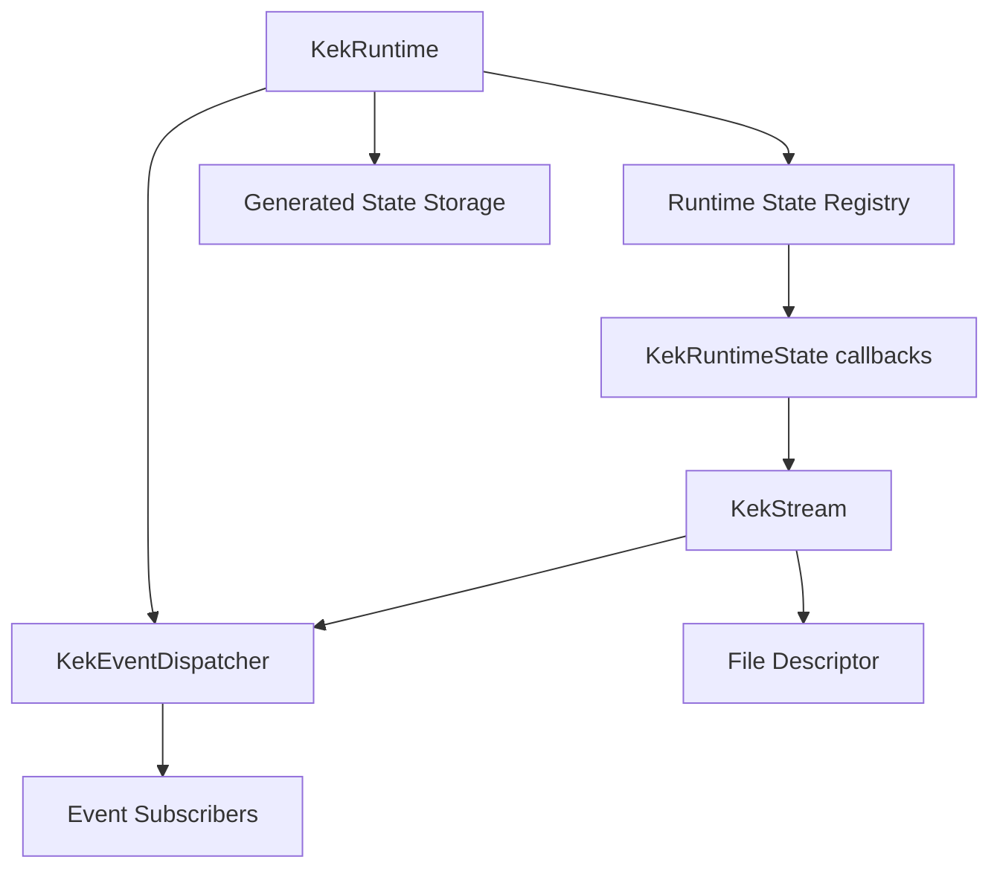
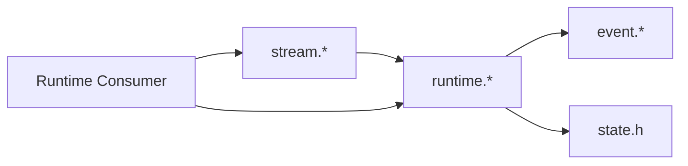
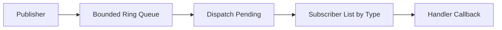
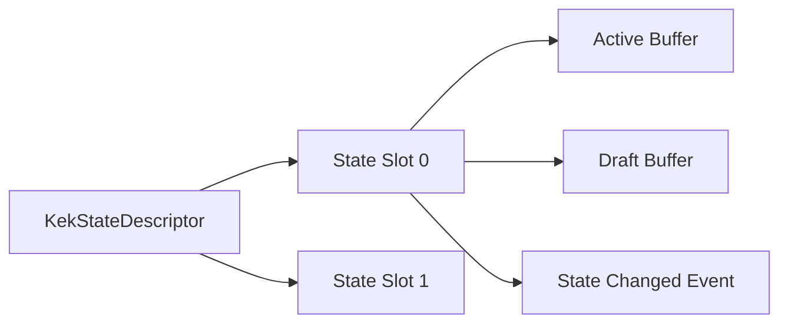
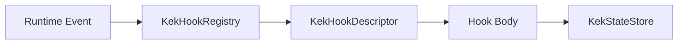
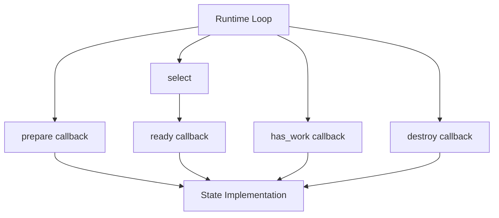
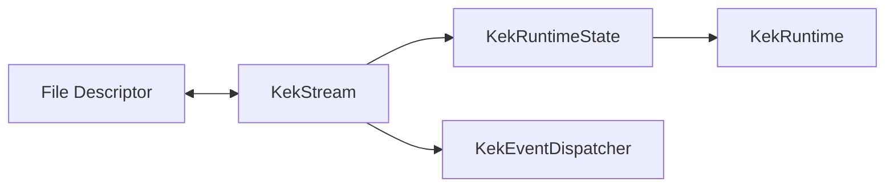

# Runtime Architecture

Related documents:

- [Runtime Requirements](requirements.md)
- [Runtime Specification](specification.md)
- [Generator Architecture](../generator/architecture.md)

## Overview

The runtime is a small single-threaded C framework built around a bounded event queue, rollback-safe generated state storage, an instance-aware generated state store, a fixed-size runtime state registry, and `select()`-based file descriptor readiness.

## Module Responsibilities

| Module | Responsibility |
| --- | --- |
| `runtime/event.h` | Event types, event payload, subscriber lists, dispatcher declarations. |
| `runtime/event.c` | Event queue operations and subscriber dispatch. |
| `runtime/hook.h` | Hook context, hook descriptor, and registry declarations. |
| `runtime/hook.c` | Generated hook registry and event filtering. |
| `runtime/state.h` | Runtime state kind and callback interface. |
| `runtime/runtime.h` | Runtime object and public runtime API. |
| `runtime/runtime.c` | Runtime initialization, state registry, event loop, drain, raw mode. |
| `runtime/stream.h` | Stream state API and stream data structure. |
| `runtime/stream.c` | Stream state implementation over file descriptors. |
| `runtime/state_storage.h` | Rollback-safe generated state storage API. |
| `runtime/state_storage.c` | Double-buffered generated state storage and instance-aware state store implementation. |

## Dependency Direction

The runtime does not depend on generated schema files. Generated code or application code may depend on the runtime.

## Event Dispatch Architecture

Events are published into a global ring buffer. Dispatch removes events from the ring buffer in FIFO order and invokes active subscribers for the event type. State-change events can identify the generated state type, concrete slot instance, and version.

Generated hooks attach to the same dispatcher through `KekHookRegistry`. The registry keeps one event subscription per event type and invokes only descriptors whose trigger matches the event.

## Runtime State Architecture

The runtime owns generic state slots. Each state implementation supplies callbacks that let the runtime remain generic.

## Generated State Store Architecture

Generated state objects can be stored independently in `KekStateStore`. Each slot points to a generated descriptor and owns two buffers for validate-before-swap updates.

Several slots may share one descriptor, enabling multiple instances of one state type.

## Hook Architecture

Hook descriptors declare their trigger plus read/write state type dependencies. The runtime hook registry filters events and invokes hook bodies supplied by application code.

## Stream Architecture

Streams adapt file descriptors to the runtime state interface.

Read streams add their fd to the read set and publish events after reads.

Write streams add their fd to the write set only when buffered data exists and flush buffered data after readiness.

## Design Constraints

- Single-threaded execution.
- Fixed maximum number of runtime states.
- Fixed event queue capacity.
- Fixed subscriber capacity per event type.
- Fixed stream buffer capacity.
- Synchronous subscriber invocation.
- Generated state storage owns two caller-sized state buffers.
