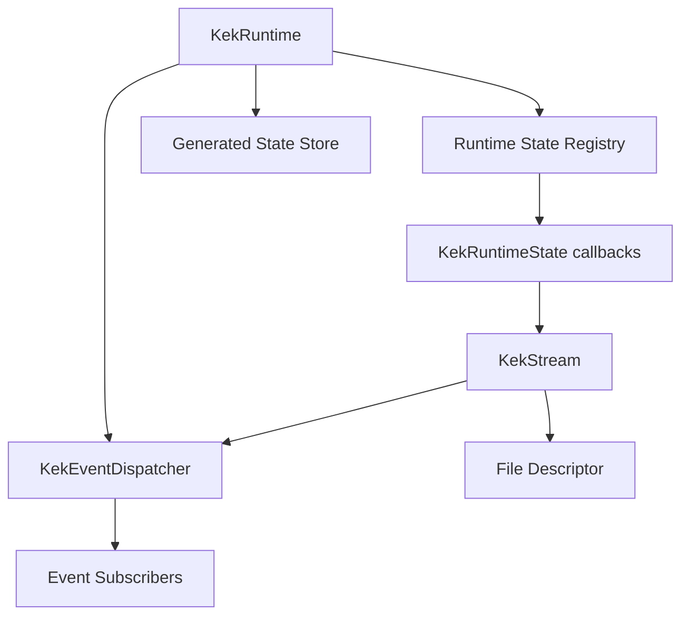
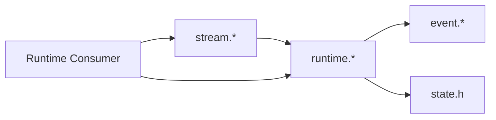
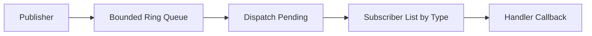
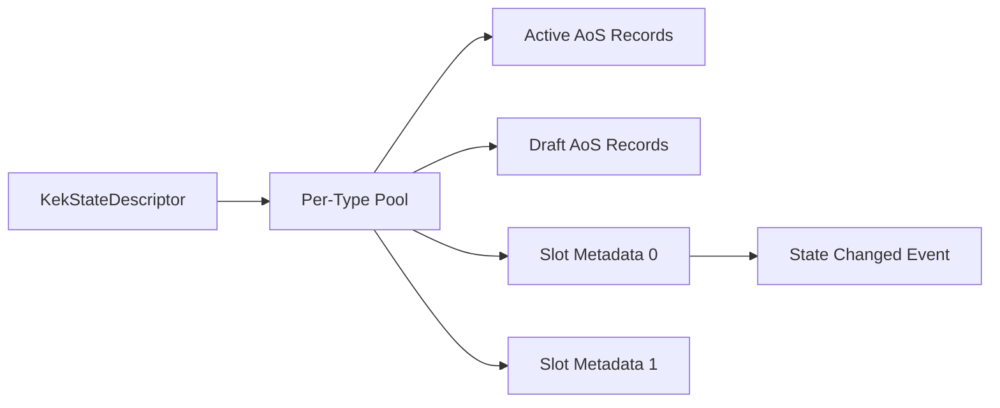
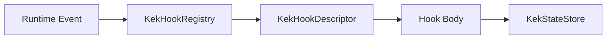
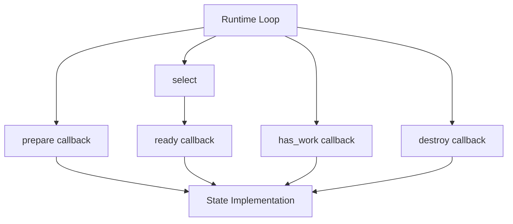
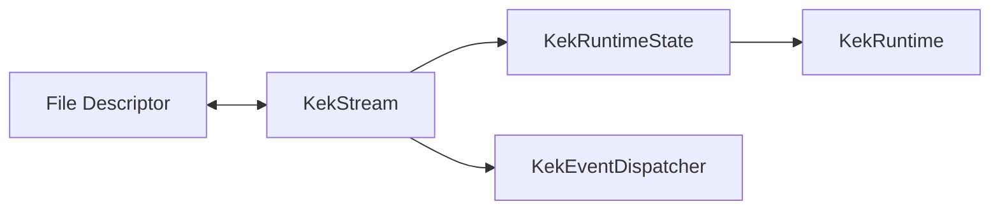

# Runtime Architecture

Related documents:

- [Runtime Requirements](requirements.md)
- [Runtime Specification](specification.md)
- [Generator Architecture](../generator/architecture.md)

## Overview

The runtime is a small C framework built around a bounded event queue, rollback-safe generated state instances, an instance-aware generated state store, a fixed-size runtime state registry, automatic read-only hook multithreading, and `select()`-based file descriptor readiness.

## Module Responsibilities

| Module | Responsibility |
| --- | --- |
| `runtime/event.h` | Event types, event payload, subscriber lists, dispatcher declarations. |
| `runtime/event.c` | Event queue operations and subscriber dispatch. |
| `runtime/hook.h` | Hook context, hook descriptor, and registry declarations. |
| `runtime/hook.c` | Generated hook registry and event filtering. |
| `runtime/state.h` | Runtime state kind and callback interface. |
| `runtime/runtime.h` | Runtime object and public runtime API. |
| `runtime/runtime.c` | Runtime initialization, state registry, event loop, drain, raw mode. |
| `runtime/thread_pool.h` | Internal worker pool declarations. |
| `runtime/thread_pool.c` | Automatic runtime worker pool and `KEK_RUNTIME_THREADS` handling. |
| `runtime/trace.h` | Optional aggregate tracing state, metric identifiers, and trace declarations. |
| `runtime/trace.c` | Runtime and hook trace aggregation, runtime-owned memory counters, and CSV writing. |
| `runtime/stream.h` | Stream state API and stream data structure. |
| `runtime/stream.c` | Stream state implementation over file descriptors. |
| `runtime/state_store.h` | Unified generated state-store declarations, descriptors, handles, arena declarations, and update callback types. |
| `runtime/state_store.c` | Arena-backed generated state store, instance updates, and state-store transactions. |

## Dependency Direction

The runtime does not depend on generated schema files. Generated code or application code may depend on the runtime.

## Event Dispatch Architecture

Events are published into a global ring buffer. Dispatch removes events from the ring buffer in FIFO order and invokes active subscribers for the event type. State-change events can identify the generated state type, concrete instance handle, and version. When the changed state fits in the fixed snapshot capacity, the event also carries copied state bytes for hooks that need the event-version value.

Generated hooks attach to the same dispatcher through `KekHookRegistry`. The registry keeps one idempotent event subscription per event type and invokes only descriptors whose trigger matches the event. Hook triggers may be state-wide across all instances of a generated state type, instance-specific to one resolved handle, or filtered to specific changed field bits.

## Runtime State Architecture

The runtime owns generic state slots. Each state implementation supplies callbacks that let the runtime remain generic.

## Generated State Store Architecture

Generated state objects are stored only in `KekStateStore`. A generated state descriptor describes the schema/type, including size, alignment, validation, merge behavior, and field metadata. Runtime instances are addressed through `KekStateHandle` values and backed by per-type arena-allocated AoS record pools. Each handle encodes the type id, a type-local pool index, and a generation; the per-type pool maps that index to the current internal backing slot and contiguous record position. Single-instance updates outside hook dispatch swap and publish immediately. Multi-instance updates prepare all drafts, validate all drafts, swap all active buffers, publish state-change events, and then publish one aggregate batch event only after the whole batch succeeds.

Hook transactions use per-instance drafts as a copy-on-write boundary. The store keeps a stack of active internal transactions. A transaction begins by recording the instance count only. Each touched instance gets a journal entry the first time it is updated, created, deleted, or reused. Existing-instance writes preserve the committed active buffer and mutate a draft until the root hook transaction commits. That root commit is the state visibility boundary for hook execution.

Several instances may share one descriptor, enabling multiple runtime values of one generated state type.

## Hook Architecture

Hook descriptors declare their trigger plus legacy read/write state type dependencies and optional precise access metadata. The runtime hook registry indexes descriptors into fixed per-event-type buckets for wildcard-state hooks and fixed per-event/per-state buckets for exact-state hooks. Dispatch visits the wildcard event bucket and the exact state bucket for the incoming event before applying instance-handle and changed-field filters. While a hook body runs, the state store checks writes against precise access metadata when available, falling back to legacy writable state types for older descriptors. Exact-instance access authorizes only that handle.

The bucket index is stored inside `KekHookRegistry`, rebuilt at attach time, and uses descriptor indices rather than extra descriptor copies. Registration and dynamic hook loading remain explicit safe-point operations, which keeps the dispatch path read-only over registry indexing data and leaves room for future lock or copy-and-swap synchronization.

Hook bodies normally read committed state through `KekStateStore`. Transactional writes made earlier in the same hook are chained internally through the transaction draft rather than exposed as public draft pointers. When hooks need the exact triggering version, they can read the copied snapshot from the triggering event through `kek_hook_event_state()`.

The registry can run adjacent read-only hooks concurrently when descriptors declare concrete read dependencies and no write dependencies. With precise access metadata, it can also run adjacent write hooks concurrently when every write is exact-instance, access sets do not conflict, and the descriptor explicitly allows parallel writes. Same-instance writes are only considered independent when both descriptors opt into field merging and their field masks are known and disjoint.

Each worker receives a cloned runtime and event queue plus a sparse state-store overlay. The overlay borrows committed pool metadata and active records read-only and allocates arena-backed drafts only for instances the worker writes. The main runtime remains the only owner of the real event queue and committed store. After a parallel wave completes successfully, the main thread applies each worker result in descriptor order. Exact-instance writes copy or merge the worker's draft value into the live store, validate the live draft, refresh state-event snapshots from the committed live instance, and replay buffered worker events in descriptor order. Hooks with opaque access, create/delete access, unknown dependencies, broad write conflicts, or dynamic hook uncertainty continue through the serial transaction path.

In debug builds compiled with `KEK_HOOK_DYNAMIC`, the registry owns mutable descriptor copies and can replace their `run` pointers from a dynamic library. The loader resolves every registered hook by descriptor name before swapping any functions, so a failed reload keeps the previous implementation active. Reloading is manual and should be called by the host at a known safe point, such as before dispatch in a frame loop.

## Stream Architecture

Streams adapt file descriptors to the runtime state interface.

Read streams add their fd to the read set and publish events after reads.

Write streams add their fd to the write set only when buffered data exists and flush buffered data after readiness.

The standard text bridge is a small utility above streams and generated string setters. It does not register file descriptors itself; applications still choose which descriptors to register, then reuse the bridge for `StandardInput` and `StandardOutput` buffer/state synchronization.

## Design Constraints

- Single-threaded runtime state prepare/ready execution.
- FIFO event dispatch from the caller's perspective.
- Hook transaction commit is the state visibility boundary.
- Parallel hook worker results are committed only on the main runtime thread and in descriptor order.
- Optional tracing is stored per runtime; built-in runtime metrics use fixed metric slots instead of mutable global state or per-record string lookups. High-volume subscriber dispatch timing is opt-in so normal trace runs can count subscriber calls without paying a clock call around every subscriber.
- Fixed maximum number of runtime states.
- Fixed event queue capacity.
- Fixed subscriber capacity per event type.
- Fixed stream buffer capacity.
- Fixed state-change snapshot capacity.
- Synchronous subscriber invocation.
- Generated state instances keep committed/draft records in the arena-backed state store.
