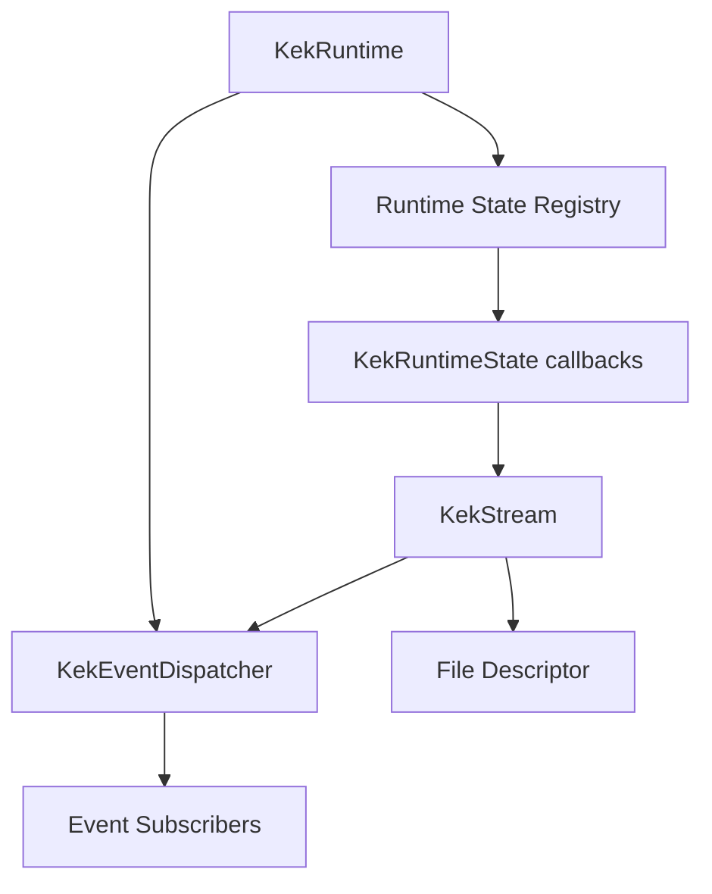
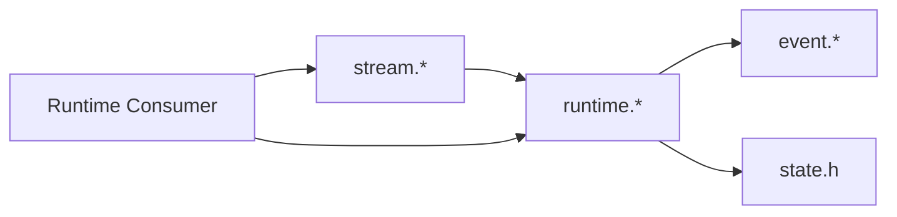
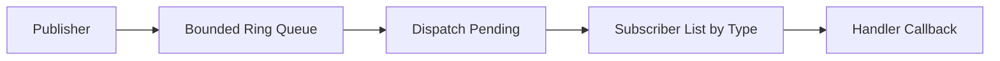
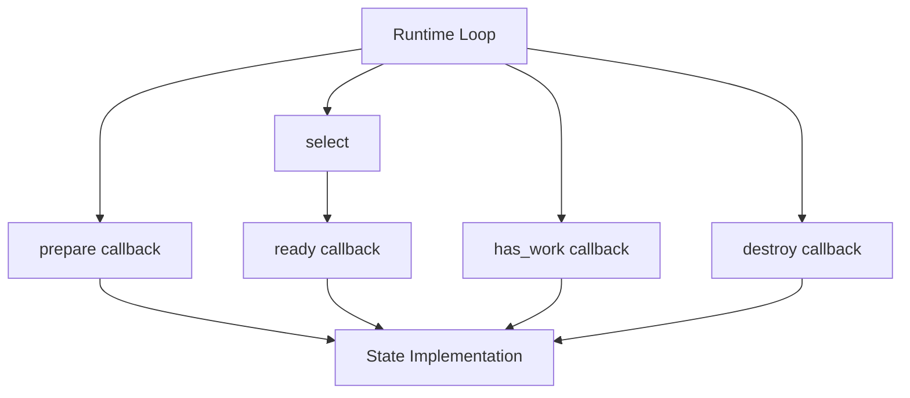
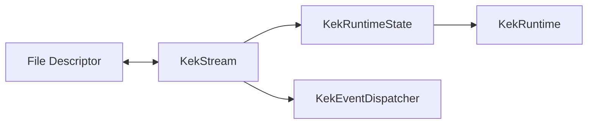

# Runtime Architecture

Related documents:

- [Runtime Requirements](requirements.md)
- [Runtime Specification](specification.md)
- [Generator Architecture](../generator/architecture.md)

## Overview

The runtime is a small single-threaded C framework built around a bounded event queue, a fixed-size runtime state registry, and `select()`-based file descriptor readiness.

## Module Responsibilities

| Module | Responsibility |
| --- | --- |
| `runtime/event.h` | Event types, event payload, subscriber lists, dispatcher declarations. |
| `runtime/event.c` | Event queue operations and subscriber dispatch. |
| `runtime/state.h` | Runtime state kind and callback interface. |
| `runtime/runtime.h` | Runtime object and public runtime API. |
| `runtime/runtime.c` | Runtime initialization, state registry, event loop, drain, raw mode. |
| `runtime/stream.h` | Stream state API and stream data structure. |
| `runtime/stream.c` | Stream state implementation over file descriptors. |

## Dependency Direction

The runtime does not depend on generated schema files. Generated code or application code may depend on the runtime.

## Event Dispatch Architecture

Events are published into a ring buffer. Dispatch removes events from the ring buffer in FIFO order and invokes active subscribers for the event type.

## Runtime State Architecture

The runtime owns generic state slots. Each state implementation supplies callbacks that let the runtime remain generic.

## Stream Architecture

Streams adapt file descriptors to the runtime state interface.

Read streams add their fd to the read set and publish events after reads.

Write streams add their fd to the write set only when buffered data exists and flush buffered data after readiness.

## Design Constraints

- Single-threaded execution.
- Fixed maximum number of runtime states.
- Fixed event queue capacity.
- Fixed subscriber capacity per event type.
- Fixed stream buffer capacity.
- Synchronous subscriber invocation.
- No ownership of generated state data.
