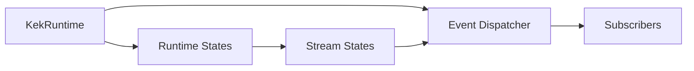

# Runtime Requirements

Related documents:

- [Runtime Specification](specification.md)
- [Runtime Architecture](architecture.md)
- [Generator Requirements](../generator/requirements.md)

## Scope

The runtime provides a single-threaded C event loop, bounded event dispatch, runtime state registration, and stream state support.

It is responsible for event processing and runtime-managed states. It is not responsible for parsing schemas or generating C code.

## Functional Requirements

| ID | Requirement | Current Status | Evidence |
| --- | --- | --- | --- |
| RT-FR-001 | Initialize and destroy a runtime instance. | Implemented | `kek_runtime_init()`, `kek_runtime_destroy()` |
| RT-FR-002 | Register runtime states. | Implemented | `kek_runtime_register_state()` |
| RT-FR-003 | Retrieve runtime states by id. | Implemented | `kek_runtime_get_state()` |
| RT-FR-004 | Run a single-threaded event loop. | Implemented | `kek_runtime_run()` |
| RT-FR-005 | Dispatch pending events to subscribers. | Implemented | `kek_event_dispatch_pending()` |
| RT-FR-006 | Subscribe and unsubscribe event handlers. | Implemented | `kek_event_subscribe()`, `kek_event_unsubscribe()` |
| RT-FR-007 | Publish events through a bounded queue. | Implemented | `kek_event_publish()` |
| RT-FR-008 | Request runtime shutdown. | Implemented | `kek_runtime_request_quit()` |
| RT-FR-009 | Drain pending events and stream writes on shutdown. | Implemented | `kek_runtime_drain()` |
| RT-FR-010 | Register file descriptors as stream states. | Implemented | `kek_runtime_register_stream()` |
| RT-FR-011 | Publish stream data, EOF, and error events. | Implemented | `runtime/stream.c` |
| RT-FR-012 | Buffer writes for writable stream states. | Implemented | `kek_stream_write()`, `kek_stream_write_raw()` |
| RT-FR-013 | Publish state-change events. | Implemented | `kek_runtime_publish_state_changed()` |
| RT-FR-014 | Enable and disable raw terminal mode when applicable. | Implemented | `kek_runtime_enable_raw_mode()`, `kek_runtime_disable_raw_mode()` |

## Non-Functional Requirements

| ID | Requirement | Current Status | Evidence |
| --- | --- | --- | --- |
| RT-NFR-001 | Use plain C. | Implemented | `runtime/*.c`, `runtime/*.h` |
| RT-NFR-002 | Keep execution single-threaded. | Implemented | `select()` loop |
| RT-NFR-003 | Keep event queue capacity bounded. | Implemented | `KEK_EVENT_QUEUE_CAPACITY` |
| RT-NFR-004 | Keep subscriber capacity bounded. | Implemented | `KEK_EVENT_MAX_SUBSCRIBERS` |
| RT-NFR-005 | Keep runtime state capacity bounded. | Implemented | `KEK_RUNTIME_MAX_STATES` |
| RT-NFR-006 | Keep stream buffers bounded. | Implemented | `KEK_STREAM_BUFFER_CAPACITY` |

## Out Of Scope

- Multi-threaded scheduling.
- Dynamic growth of event queues, subscribers, runtime states, or stream buffers.
- Generated-state ownership.
- Per-generated-state queues.
- Rollback semantics.
- Compiled transition or hook dispatch.

## Requirement Relationship

