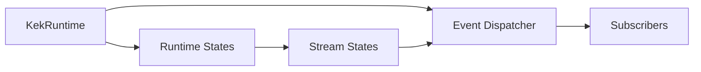

# Runtime Requirements

Related documents:

- [Runtime Specification](specification.md)
- [Runtime Architecture](architecture.md)
- [Generator Requirements](../generator/requirements.md)

## Scope

The runtime provides a C event loop, bounded event dispatch, automatic read-only hook multithreading, runtime state registration, and stream state support.

It is responsible for event processing and runtime-managed states. It is not responsible for parsing schemas or generating C code.

## Functional Requirements

| ID | Requirement | Current Status | Evidence |
| --- | --- | --- | --- |
| RT-FR-001 | Initialize and destroy a runtime instance. | Implemented | `kek_runtime_init()`, `kek_runtime_destroy()` |
| RT-FR-002 | Register runtime states. | Implemented | `kek_runtime_register_state()` |
| RT-FR-003 | Retrieve runtime states by id. | Implemented | `kek_runtime_get_state()` |
| RT-FR-004 | Run a single-threaded event loop. | Implemented | `kek_runtime_run()` |
| RT-FR-005 | Dispatch pending events to subscribers. | Implemented | `kek_event_dispatch_pending()` |
| RT-FR-006 | Subscribe and unsubscribe event handlers. | Implemented | `kek_event_subscribe()`, `kek_event_unsubscribe()` |
| RT-FR-007 | Publish events through a bounded queue. | Implemented | `kek_event_publish()` |
| RT-FR-008 | Request runtime shutdown. | Implemented | `kek_runtime_request_quit()` |
| RT-FR-009 | Drain pending events and stream writes on shutdown. | Implemented | `kek_runtime_drain()` |
| RT-FR-010 | Register file descriptors as stream states. | Implemented | `kek_runtime_register_stream()` |
| RT-FR-011 | Publish stream data, EOF, and error events. | Implemented | `runtime/stream.c` |
| RT-FR-012 | Buffer writes for writable stream states. | Implemented | `kek_stream_write()`, `kek_stream_write_raw()` |
| RT-FR-013 | Publish state-change events. | Implemented | `kek_runtime_publish_state_changed()` |
| RT-FR-014 | Enable and disable raw terminal mode when applicable. | Implemented | `kek_runtime_enable_raw_mode()`, `kek_runtime_disable_raw_mode()` |
| RT-FR-015 | Validate generated state updates before publishing them. | Implemented | `kek_state_storage_update()`, `kek_state_store_update()` |
| RT-FR-016 | Store generated states independently. | Implemented | `KekStateStore`, `KekStateSlot` |
| RT-FR-017 | Support multiple instances of the same generated state type. | Implemented | Multiple slots can share one `KekStateDescriptor` |
| RT-FR-018 | Publish state-changed events with state type, slot, and version metadata. | Implemented | `KekEvent.state_type_id`, `state_slot_id`, `state_version` |
| RT-FR-019 | Register and dispatch generated hook descriptors. | Implemented | `KekHookRegistry`, `KekHookDescriptor` |
| RT-FR-020 | Commit multi-slot generated state updates transactionally. | Implemented | `kek_state_store_update_many()` |
| RT-FR-021 | Expose event-version state snapshots to hooks when bounded capacity permits. | Implemented | `KekEvent.state_snapshot`, `kek_hook_event_state()` |
| RT-FR-022 | Enforce hook-declared generated state writes during hook execution. | Implemented | `state_store_write_allowed()` |
| RT-FR-023 | Allow hook writes to the triggering slot when the triggering state type is declared writable. | Implemented | `state_store_write_allowed()` |
| RT-FR-024 | Provide reusable standard text state bridge helpers. | Implemented | `KekStandardTextBridge` |
| RT-FR-025 | Support debug loading and replacement of hook functions from dynamic libraries. | Implemented | `kek_hook_registry_load_library()`, `kek_hook_registry_reload_library()` |
| RT-FR-026 | Write runtime and hook tracing metrics to separate CSV files when enabled. | Implemented | `KEK_TRACE_RUNTIME_CSV`, `KEK_TRACE_HOOKS_CSV`, `runtime/trace.c` |
| RT-FR-027 | Roll back hook state writes and queued events without copying untouched writable slots. | Implemented | Internal copy-on-write `KekStateStoreTransaction` journal |
| RT-FR-028 | Configure runtime hook worker count automatically or through an environment override. | Implemented | `KEK_RUNTIME_THREADS`, `runtime/thread_pool.c` |
| RT-FR-029 | Run dependency-safe read-only generated hooks concurrently without changing hook bodies. | Implemented | `KekHookDescriptor.reads`, `runtime/hook.c` |

## Non-Functional Requirements

| ID | Requirement | Current Status | Evidence |
| --- | --- | --- | --- |
| RT-NFR-001 | Use plain C. | Implemented | `runtime/*.c`, `runtime/*.h` |
| RT-NFR-002 | Keep runtime state prepare/ready execution single-threaded and event dispatch FIFO from the caller's perspective. | Implemented | `select()` loop, `kek_event_dispatch_pending()` |
| RT-NFR-003 | Keep event queue capacity bounded. | Implemented | `KEK_EVENT_QUEUE_CAPACITY` |
| RT-NFR-004 | Keep subscriber capacity bounded. | Implemented | `KEK_EVENT_MAX_SUBSCRIBERS` |
| RT-NFR-005 | Keep runtime state capacity bounded. | Implemented | `KEK_RUNTIME_MAX_STATES` |
| RT-NFR-006 | Keep stream buffers bounded. | Implemented | `KEK_STREAM_BUFFER_CAPACITY` |
| RT-NFR-007 | Keep tracing optional, internally aggregated, and low-overhead for known runtime metrics. | Implemented | Tracing is disabled unless a trace CSV environment variable is set; built-in runtime metrics use direct metric slots and per-subscriber timing is opt-in. |
| RT-NFR-008 | Keep committed state buffers stable during hook transactions. | Implemented | Transaction drafts are not made active until hook commit. |

## Out Of Scope

- Multi-threaded scheduling for runtime state `prepare`/`ready` callbacks and state-writing hooks.
- Dynamic growth of event queues, subscribers, runtime states, or stream buffers.
- Per-generated-state queues.
- Compiled transition or hook dispatch.
- Declarative schema-driven standard stream registration.

## Requirement Relationship

