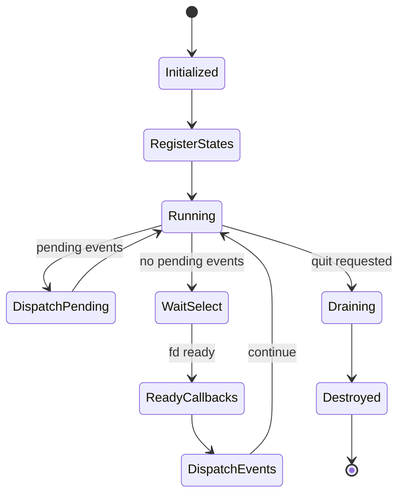

# Runtime Specification

Related documents:

- [Runtime Requirements](requirements.md)
- [Runtime Architecture](architecture.md)
- [Generator Specification](../generator/specification.md)

## Runtime Object

`KekRuntime` owns:

- A `KekEventDispatcher`.
- A fixed-size array of `KekRuntimeState` entries.
- Runtime state count.
- Quit flag.
- Raw terminal mode bookkeeping.
- Optional aggregate tracing state.
- An automatic worker pool for dependency-safe generated hook dispatch.

The runtime capacity is `KEK_RUNTIME_MAX_STATES`.

`KekRuntimeApp` is the recommended convenience container for applications that use generated state stores and generated hooks together. It owns:

- A `KekRuntime`.
- A `KekStateStore` bound to that runtime.
- A `KekHookRegistry` bound to that runtime and state store.

`kek_runtime_app_init()` initializes all three pieces, `kek_runtime_app_bind_hooks()` registers and attaches hook descriptors, `kek_runtime_app_dispatch()` dispatches pending events, and `kek_runtime_app_destroy()` detaches hooks, destroys the state store, and destroys the runtime. The lower-level `KekRuntime`, `KekStateStore`, and `KekHookRegistry` APIs remain available for custom ownership models.

## Runtime Tracing

Tracing is disabled by default. Applications can enable it without code changes by setting one or both environment variables before `kek_runtime_init()`:

| Environment Variable | Purpose |
| --- | --- |
| `KEK_TRACE_RUNTIME_CSV` | Path for runtime/internal aggregate metrics. |
| `KEK_TRACE_HOOKS_CSV` | Path for application hook aggregate metrics. |
| `KEK_TRACE_SUBSCRIBER_TIMING` | Optional nonzero value that enables per-subscriber dispatch timing. |

When tracing is enabled, the runtime records aggregate count, total time, average time, min time, and max time in nanoseconds. `kek_runtime_destroy()` writes the enabled CSV files on a best-effort basis; CSV write failures do not change runtime destroy behavior.

The runtime CSV uses:

```text
metric,count,total_ns,avg_ns,min_ns,max_ns,current_bytes,peak_bytes,total_allocated_bytes,total_freed_bytes
```

Runtime metrics include event publishing, event dispatch, subscriber dispatch, runtime state prepare/ready callbacks, `select()` wait time, state copy operations, validation callbacks, update callbacks, transaction snapshot copies, and runtime-owned allocation/free calls.

Memory columns track runtime-owned allocations only, such as state buffers, transaction snapshots, stream states, and timer states. They do not report process RSS or allocations performed by application hook bodies.

Built-in runtime metrics are recorded through fixed per-runtime metric slots. The public string-based runtime tracing helper remains available for ad hoc metrics, but runtime internals use direct metric identifiers to avoid per-record string lookup overhead and to keep future synchronization around trace aggregation localized to each runtime instance.

By default, `event_subscriber_dispatch` counts subscriber calls without timing each subscriber individually, because high-volume per-subscriber clocks can dominate stress traces. Set `KEK_TRACE_SUBSCRIBER_TIMING` to a nonzero value to populate subscriber dispatch duration columns when that detail is needed.

The hooks CSV uses:

```text
hook,event_type,state_type_id,state_slot_id,call_count,success_count,failure_count,total_wait_ns,avg_wait_ns,min_wait_ns,max_wait_ns,total_run_ns,avg_run_ns,min_run_ns,max_run_ns
```

Hook wait time is measured from event publication to immediately before the matching hook body is invoked. Hook run time is measured around the hook function call itself. Hook bodies and generated descriptors do not need tracing-specific changes.

## Runtime Threads

`KekRuntime` initializes a small worker pool automatically. Applications can configure the pool before `kek_runtime_init()` with `KEK_RUNTIME_THREADS`:

| Value | Behavior |
| --- | --- |
| unset or `auto` | Use a conservative CPU-based worker count. |
| `1` | Force single-threaded hook dispatch. |
| positive integer `N` | Use up to `N` total runtime threads, including the caller thread. |

`kek_runtime_thread_count()` reports the caller thread plus active worker threads. If worker creation fails or the requested count is one, dispatch falls back to serial execution.

## State Storage

`KekStateStore` is the only storage API for generated state values. Generated state descriptors describe schema/type information: type id, name, size, alignment, optional pool capacity, default/reset/check callbacks, field merge callback, and generated field metadata. Runtime values are independent instances addressed by `KekStateHandle`.

`KekStateHandle` encodes the generated state type id, a type-local pool index, and a generation. The handle index is not a global store slot index; different state types can use the same pool index at the same time. The store resolves handles through per-type pools, which map pool indices to the current internal backing slot and reject stale generations after delete/reuse.

Multiple instances may reference the same descriptor. This supports multiple runtime values of one generated state type, such as several `Enemy` objects.

Each per-type pool owns two contiguous arena-backed AoS record slabs: one record array for each swap buffer. Slot metadata stores descriptor, active buffer index, version, generation, and pool index separately from the records. Normal instance deletion makes the handle available for reuse without freeing individual state buffers. Store destruction releases the arena, or any fallback-owned pool slabs if arena allocation was exhausted.

`kek_state_store_update()` copies the active instance value into its draft, invokes the update callback, validates the draft with the descriptor check function, swaps on success, increments the instance version, and publishes `KEK_EVENT_STATE_CHANGED` with state type id, instance handle, version, and an unknown changed-field mask. `kek_state_store_update_fields()` behaves the same way but publishes the caller-provided field bitmask.

`kek_state_store_update_many()` applies a bounded batch of independent instance updates transactionally. It prepares and validates every draft first. If any update, validation, or event publication fails, active instances, draft buffers, and versions are rolled back. If all updates validate and all events publish, every active instance is swapped, each changed instance version is incremented, and one `KEK_EVENT_STATE_CHANGED` event is published per changed instance after the full batch commit.

`kek_state_store_remove()` deletes an instance, publishes `KEK_EVENT_STATE_DELETED`, and makes the type-local pool entry available for reuse with a new generation. `kek_state_store_add()` reuses deleted entries before growing the store and publishes `KEK_EVENT_STATE_CREATED` for the new instance.

Hook dispatch opens an internal copy-on-write state-store transaction. Beginning a hook transaction records the current instance count but does not copy live state buffers. The first transactional update to an existing instance copies the committed active buffer into a draft, keeps the original active buffer visible through `kek_state_store_current*()`, and records the original metadata in a bounded journal. Repeated transactional updates to the same instance continue from the transaction draft and validate after each update. Successful transactional updates publish events whose snapshots contain the draft bytes and pending version, even though store reads continue to expose the committed active buffer until the hook commits.

If a hook succeeds, the transaction commits by making dirty drafts active and applying pending versions. If a hook fails, the transaction restores recorded metadata, removes instances created by the hook, restores deleted instances, restores deleted-and-reused handles, and discards queued events produced by the hook. Nested transactions merge successful child journals into their parent and restore the parent draft if the child fails after writing a parent-dirty instance.

Parallel hook workers use sparse overlays rather than full store clones. A worker store borrows the committed pool metadata and active records read-only, allocates draft records only for written instances from embedded scratch arena space, and reports overlay draft bytes through tracing. Successful worker overlays are applied by the main thread in descriptor order.

## Runtime State Interface

`KekRuntimeState` is the generic state interface used by the event loop.

Each state contains:

| Field | Purpose |
| --- | --- |
| `kind` | State category. |
| `data` | State-owned implementation data. |
| `prepare` | Adds file descriptors to read/write sets before `select()`. |
| `ready` | Handles file descriptor readiness after `select()`. |
| `has_work` | Reports pending work during drain. |
| `destroy` | Releases state-owned resources. |

Supported state kinds:

| Kind | Purpose |
| --- | --- |
| `KEK_RUNTIME_STATE_STREAM` | Runtime stream wrapper around a file descriptor. |
| `KEK_RUNTIME_STATE_TIMER` | Runtime timer that updates a generated timer state slot. |
| `KEK_RUNTIME_STATE_CUSTOM` | Reserved custom state kind. |

## Event Dispatcher

The dispatcher provides a bounded FIFO event queue and per-event-type subscriber lists.

Subscribing the same active `(event type, handler, context)` pair more than once is idempotent. It returns success without adding a duplicate subscriber, so one event dispatch invokes that handler/context pair at most once per event type. Unsubscribe removes the active pair and compacts the subscriber list.

Event types:

| Event | Purpose |
| --- | --- |
| `KEK_EVENT_STREAM_DATA` | Stream data was read. |
| `KEK_EVENT_STREAM_EOF` | Stream reached EOF. |
| `KEK_EVENT_STREAM_ERROR` | Stream operation failed. |
| `KEK_EVENT_STATE_CHANGED` | A state change was published. |
| `KEK_EVENT_STATE_CREATED` | A generated state-store slot was created. |
| `KEK_EVENT_STATE_DELETED` | A generated state-store slot was deleted. |
| `KEK_EVENT_STATE_BATCH_CHANGED` | A transactional generated state-store batch committed. |

State-change events may carry:

| Field | Purpose |
| --- | --- |
| `state_type_id` | Generated state type identifier. |
| `state_slot_id` | Runtime slot instance identifier. |
| `state_version` | Version after the successful update. |
| `changed_fields` | Bitmask of generated fields changed by the update, `KEK_EVENT_CHANGED_FIELDS_NONE`, or `KEK_EVENT_CHANGED_FIELDS_UNKNOWN`. |
| `state_snapshot` | Copied event-version state bytes when the state fits in `KEK_EVENT_STATE_SNAPSHOT_CAPACITY`. |
| `state_snapshot_size` | Number of copied state bytes. |
| `has_state_snapshot` | Whether `state_snapshot` contains a valid copied state. |

Capacity constants:

| Constant | Value | Meaning |
| --- | --- | --- |
| `KEK_EVENT_MAX_SUBSCRIBERS` | `32` | Max subscribers per event type. |
| `KEK_EVENT_QUEUE_CAPACITY` | `256` | Max queued events. |
| `KEK_EVENT_DATA_CAPACITY` | `1024` | Max bytes copied into event payload. |
| `KEK_EVENT_STATE_SNAPSHOT_CAPACITY` | `1024` | Max bytes copied into a state-change snapshot. |
| `KEK_EVENT_TYPE_COUNT` | `7` | Number of event types. |

Publishing fails and drops the event when the queue is full.

Dispatch is synchronous: each active subscriber for the event type is called before the dispatcher moves to the next queued event. Dispatch stops and reports failure when a subscriber returns failure.

## Hook Registry

`KekHookRegistry` bridges generated hook descriptors to the event dispatcher. A registry stores hook descriptors, indexes wildcard-state hooks by event type, indexes exact-state hooks by event type and state type, subscribes one internal handler to runtime event types, filters the matching bucket entries by optional instance handle and changed fields, and invokes matching hook functions with `KekHookContext`.

`KekHookContext` contains:

| Field | Purpose |
| --- | --- |
| `runtime` | Runtime that received the event. |
| `state_store` | Independent generated state slots. |
| `event` | Triggering event. |
| `app_context` | Application-owned context pointer. |

Hook descriptors declare legacy read and write state type ids plus optional precise access descriptors. A descriptor may match all instances of a state type or one concrete instance handle. It may also declare `trigger_fields`; when nonzero, the hook only runs for state-change events whose changed-field mask intersects the descriptor mask. Unknown changed-field masks conservatively run matching hooks.

Precise hook access descriptors identify read, write, create, and delete permissions by generated state type, exact instance, scope, and field mask. Generated schemas can use exact named instances for maximum precision. When access descriptors are present, the runtime uses them for scheduling and write authorization; otherwise, it falls back to legacy `reads`/`writes`.

During hook execution, `KekStateStore` write operations are rejected when the target is not covered by the running hook descriptor's precise write/create/delete access, or by the legacy `writes` list when precise access is absent. Exact-instance access only authorizes that instance. Hooks may update the exact instance that triggered them when that state type or instance is declared writable. If a hook returns failure, state changes and queued events produced by that hook invocation are rolled back, event dispatch fails, and the runtime run/drain call propagates that error. The transaction API remains internal to hook dispatch; application code should continue using the state-store update/create/delete APIs.

Dispatch remains FIFO at the event level. For one event, the hook registry collects matching generated hook descriptors in descriptor order, partitions adjacent dependency-safe hooks into waves, and may run read-only hooks with explicit `reads` metadata concurrently. With precise access metadata, hooks with exact-instance non-overlapping writes may also run concurrently. Same-instance disjoint-field writes may run concurrently only when every participating descriptor sets `KEK_HOOK_SCHEDULING_FIELD_MERGE_SAFE` and generated field masks do not overlap. Opaque hooks, create/delete access, unknown write targets, overlapping writes, or broad conflicts use the serial transaction path.

Worker-thread hooks run against cloned runtime/event contexts and sparse state-store overlays. After every hook in a wave succeeds, the main runtime applies worker state results in descriptor order, validates merged drafts, refreshes worker-produced state events from the live committed instance, replays buffered events in descriptor order, and propagates worker quit requests.

`kek_hook_event_state()` returns the copied event-version state snapshot when present. Hook bodies can use this when the triggering state value must match `event->state_version` instead of the current store value after later queued updates.

When compiled with `KEK_HOOK_DYNAMIC`, a hook registry can load hook bodies from a dynamic library at an application-chosen safe point:

- `kek_hook_registry_load_library(registry, path)` resolves every registered hook by descriptor name and swaps all `run` pointers only after every symbol resolves.
- `kek_hook_registry_reload_library(registry)` reloads the last successful path.
- `kek_hook_registry_unload_library(registry)` closes the loaded library.

Failed loads are non-destructive: the previously active hook implementation remains installed. Applications must call load or reload before dispatching events when generated descriptors were compiled with dynamic hook mode, because generated dynamic descriptors intentionally start with null hook function pointers.

## Event Loop

`kek_runtime_run()` repeats until quit is requested or no file descriptors are registered for waiting.

Loop behavior:

1. Clear read/write fd sets.
2. Ask each runtime state to prepare fd sets.
3. Dispatch queued events immediately if any exist.
4. Exit if no file descriptor is available.
5. Wait with `select()`.
6. Ask each runtime state to handle readiness.
7. Dispatch newly queued events.
8. On quit, dispatch remaining events and drain pending state work.

## Drain Behavior

`kek_runtime_drain()` continues while any runtime state reports work or events remain queued.

Drain is currently used to flush pending write-stream data and dispatch remaining events during shutdown.

## Stream State

`KekStream` wraps a file descriptor in one of two modes:

| Mode | Behavior |
| --- | --- |
| `KEK_STREAM_READ` | Waits for readability and publishes stream events. |
| `KEK_STREAM_WRITE` | Buffers outgoing data and flushes on writability. |

`KekStream` stores:

- File descriptor.
- Mode.
- Close-on-destroy flag.
- Closed flag.
- Fixed-size buffer.
- Current buffered byte length.

The stream buffer capacity is `KEK_STREAM_BUFFER_CAPACITY`.

`kek_stream_flush()` attempts to synchronously write any currently buffered bytes for a write stream. It is useful for applications that need bounded-buffer backpressure before queuing more output.

`KekStandardTextBridge` is a reusable bridge for generated single-string standard states. It appends stream input into a caller-owned buffer and updates the generated `StandardInput` slot through a generated string setter. It can also track written bytes in a generated `StandardOutput` slot while writing through a `KekStream`.

## Raw Terminal Mode

The runtime can put a TTY file descriptor into raw-ish mode by disabling canonical input and echo.

If the file descriptor is not a TTY, enabling raw mode is a successful no-op.

The original terminal configuration is stored on the runtime and restored by `kek_runtime_disable_raw_mode()` when raw mode was enabled.

## Runtime Flow


