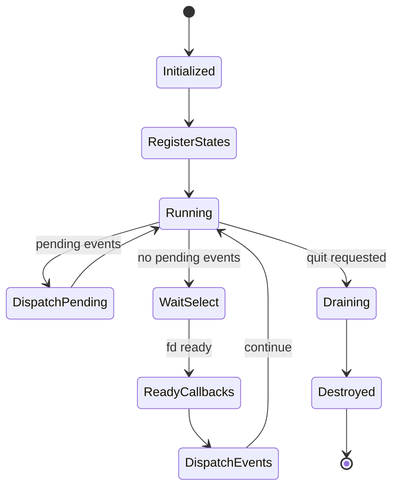

# Runtime Specification

Related documents:

- [Runtime Requirements](requirements.md)
- [Runtime Architecture](architecture.md)
- [Generator Specification](../generator/specification.md)

## Runtime Object

`KekRuntime` owns:

- A `KekEventDispatcher`.
- A fixed-size array of `KekRuntimeState` entries.
- Runtime state count.
- Quit flag.
- Raw terminal mode bookkeeping.

The runtime capacity is `KEK_RUNTIME_MAX_STATES`.

## State Storage

`KekStateStorage` is a separate runtime utility for owning generated state objects.

It stores two copies of a state object:

- The active copy, which remains readable while updates are attempted.
- The inactive copy, which is used as a draft for the next update.

`kek_state_storage_update()` copies the active state into the inactive draft, invokes the caller-provided update callback, validates the draft with the caller-provided check function, and swaps active buffers only when validation succeeds.

If validation fails, the active state is unchanged and the draft is reset from the active copy. A successful update publishes a state-changed notification for the new active state pointer.

`KekStateStore` is the instance-aware storage API for generated states. It owns independent `KekStateSlot` entries instead of one aggregate object. Each slot stores two buffers, one active index, a generated `KekStateDescriptor`, and a monotonically increasing version.

Multiple slots may reference the same descriptor. This supports multiple instances of one generated state type, such as several `Goblin` objects.

`kek_state_store_update()` copies the active slot value into its inactive draft, invokes the update callback, validates the draft with the descriptor check function, swaps on success, increments the slot version, and publishes `KEK_EVENT_STATE_CHANGED` with state type id, slot id, version, and an unknown changed-field mask. `kek_state_store_update_fields()` behaves the same way but publishes the caller-provided field bitmask.

`kek_state_store_update_many()` applies a bounded batch of independent slot updates transactionally. It prepares and validates every draft first. If any update, validation, or event publication fails, active slots, draft buffers, and versions are rolled back. If all updates validate and all events publish, every active slot is swapped, each changed slot version is incremented, and one `KEK_EVENT_STATE_CHANGED` event is published per changed slot after the full batch commit.

`kek_state_store_remove()` deletes a slot, publishes `KEK_EVENT_STATE_DELETED`, and makes the slot id available for reuse. `kek_state_store_add()` reuses deleted slots before growing the store and publishes `KEK_EVENT_STATE_CREATED` for the new slot.

## Runtime State Interface

`KekRuntimeState` is the generic state interface used by the event loop.

Each state contains:

| Field | Purpose |
| --- | --- |
| `kind` | State category. |
| `data` | State-owned implementation data. |
| `prepare` | Adds file descriptors to read/write sets before `select()`. |
| `ready` | Handles file descriptor readiness after `select()`. |
| `has_work` | Reports pending work during drain. |
| `destroy` | Releases state-owned resources. |

Supported state kinds:

| Kind | Purpose |
| --- | --- |
| `KEK_RUNTIME_STATE_STREAM` | Runtime stream wrapper around a file descriptor. |
| `KEK_RUNTIME_STATE_TIMER` | Runtime timer that updates a generated timer state slot. |
| `KEK_RUNTIME_STATE_CUSTOM` | Reserved custom state kind. |

## Event Dispatcher

The dispatcher provides a bounded FIFO event queue and per-event-type subscriber lists.

Event types:

| Event | Purpose |
| --- | --- |
| `KEK_EVENT_STREAM_DATA` | Stream data was read. |
| `KEK_EVENT_STREAM_EOF` | Stream reached EOF. |
| `KEK_EVENT_STREAM_ERROR` | Stream operation failed. |
| `KEK_EVENT_STATE_CHANGED` | A state change was published. |
| `KEK_EVENT_STATE_CREATED` | A generated state-store slot was created. |
| `KEK_EVENT_STATE_DELETED` | A generated state-store slot was deleted. |
| `KEK_EVENT_STATE_BATCH_CHANGED` | A transactional generated state-store batch committed. |

State-change events may carry:

| Field | Purpose |
| --- | --- |
| `state_type_id` | Generated state type identifier. |
| `state_slot_id` | Runtime slot instance identifier. |
| `state_version` | Version after the successful update. |
| `changed_fields` | Bitmask of generated fields changed by the update, `KEK_EVENT_CHANGED_FIELDS_NONE`, or `KEK_EVENT_CHANGED_FIELDS_UNKNOWN`. |
| `state_snapshot` | Copied event-version state bytes when the state fits in `KEK_EVENT_STATE_SNAPSHOT_CAPACITY`. |
| `state_snapshot_size` | Number of copied state bytes. |
| `has_state_snapshot` | Whether `state_snapshot` contains a valid copied state. |

Capacity constants:

| Constant | Value | Meaning |
| --- | --- | --- |
| `KEK_EVENT_MAX_SUBSCRIBERS` | `32` | Max subscribers per event type. |
| `KEK_EVENT_QUEUE_CAPACITY` | `256` | Max queued events. |
| `KEK_EVENT_DATA_CAPACITY` | `1024` | Max bytes copied into event payload. |
| `KEK_EVENT_STATE_SNAPSHOT_CAPACITY` | `1024` | Max bytes copied into a state-change snapshot. |
| `KEK_EVENT_TYPE_COUNT` | `7` | Number of event types. |

Publishing fails and drops the event when the queue is full.

Dispatch is synchronous: each active subscriber for the event type is called before the dispatcher moves to the next queued event. Dispatch stops and reports failure when a subscriber returns failure.

## Hook Registry

`KekHookRegistry` bridges generated hook descriptors to the event dispatcher. A registry stores hook descriptors, subscribes one internal handler to runtime event types, filters by event type plus optional generated state type and slot id, and invokes matching hook functions with `KekHookContext`.

`KekHookContext` contains:

| Field | Purpose |
| --- | --- |
| `runtime` | Runtime that received the event. |
| `state_store` | Independent generated state slots. |
| `event` | Triggering event. |
| `app_context` | Application-owned context pointer. |

Hook descriptors declare read and write state type ids. A descriptor may match all slots of a state type or one concrete slot id. It may also declare `trigger_fields`; when nonzero, the hook only runs for state-change events whose changed-field mask intersects the descriptor mask. Unknown changed-field masks conservatively run matching hooks.

During hook execution, `KekStateStore` write operations are rejected when the target state type is not listed in the running hook descriptor's `writes`. Hooks may update the exact slot that triggered them when that state type is declared writable. If a hook returns failure, state changes and queued events produced by that hook invocation are rolled back, event dispatch fails, and the runtime run/drain call propagates that error.

`kek_hook_event_state()` returns the copied event-version state snapshot when present. Hook bodies can use this when the triggering state value must match `event->state_version` instead of the current store value after later queued updates.

## Event Loop

`kek_runtime_run()` repeats until quit is requested or no file descriptors are registered for waiting.

Loop behavior:

1. Clear read/write fd sets.
2. Ask each runtime state to prepare fd sets.
3. Dispatch queued events immediately if any exist.
4. Exit if no file descriptor is available.
5. Wait with `select()`.
6. Ask each runtime state to handle readiness.
7. Dispatch newly queued events.
8. On quit, dispatch remaining events and drain pending state work.

## Drain Behavior

`kek_runtime_drain()` continues while any runtime state reports work or events remain queued.

Drain is currently used to flush pending write-stream data and dispatch remaining events during shutdown.

## Stream State

`KekStream` wraps a file descriptor in one of two modes:

| Mode | Behavior |
| --- | --- |
| `KEK_STREAM_READ` | Waits for readability and publishes stream events. |
| `KEK_STREAM_WRITE` | Buffers outgoing data and flushes on writability. |

`KekStream` stores:

- File descriptor.
- Mode.
- Close-on-destroy flag.
- Closed flag.
- Fixed-size buffer.
- Current buffered byte length.

The stream buffer capacity is `KEK_STREAM_BUFFER_CAPACITY`.

`kek_stream_flush()` attempts to synchronously write any currently buffered bytes for a write stream. It is useful for applications that need bounded-buffer backpressure before queuing more output.

`KekStandardTextBridge` is a reusable bridge for generated single-string standard states. It appends stream input into a caller-owned buffer and updates the generated `StandardInput` slot through a generated string setter. It can also track written bytes in a generated `StandardOutput` slot while writing through a `KekStream`.

## Raw Terminal Mode

The runtime can put a TTY file descriptor into raw-ish mode by disabling canonical input and echo.

If the file descriptor is not a TTY, enabling raw mode is a successful no-op.

The original terminal configuration is stored on the runtime and restored by `kek_runtime_disable_raw_mode()` when raw mode was enabled.

## Runtime Flow

