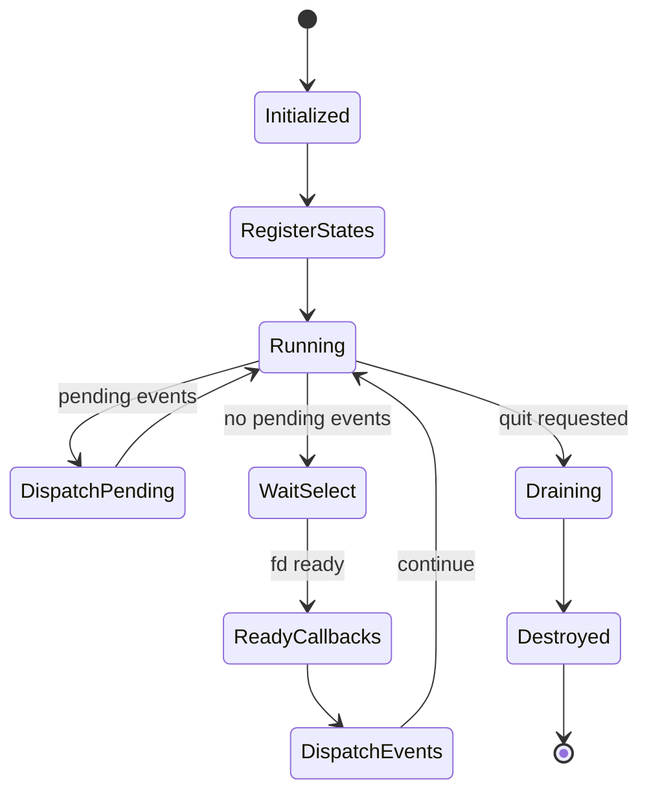

# Runtime Specification

Related documents:

- [Runtime Requirements](requirements.md)
- [Runtime Architecture](architecture.md)
- [Generator Specification](../generator/specification.md)

## Runtime Object

`KekRuntime` owns:

- A `KekEventDispatcher`.
- A fixed-size array of `KekRuntimeState` entries.
- Runtime state count.
- Quit flag.
- Raw terminal mode bookkeeping.

The runtime capacity is `KEK_RUNTIME_MAX_STATES`.

## Runtime State Interface

`KekRuntimeState` is the generic state interface used by the event loop.

Each state contains:

| Field | Purpose |
| --- | --- |
| `kind` | State category. |
| `data` | State-owned implementation data. |
| `prepare` | Adds file descriptors to read/write sets before `select()`. |
| `ready` | Handles file descriptor readiness after `select()`. |
| `has_work` | Reports pending work during drain. |
| `destroy` | Releases state-owned resources. |

Supported state kinds:

| Kind | Purpose |
| --- | --- |
| `KEK_RUNTIME_STATE_STREAM` | Runtime stream wrapper around a file descriptor. |
| `KEK_RUNTIME_STATE_CUSTOM` | Reserved custom state kind. |

## Event Dispatcher

The dispatcher provides a bounded FIFO event queue and per-event-type subscriber lists.

Event types:

| Event | Purpose |
| --- | --- |
| `KEK_EVENT_STREAM_DATA` | Stream data was read. |
| `KEK_EVENT_STREAM_EOF` | Stream reached EOF. |
| `KEK_EVENT_STREAM_ERROR` | Stream operation failed. |
| `KEK_EVENT_STATE_CHANGED` | A state change was published. |
| `KEK_EVENT_QUIT` | Reserved event type. |

Capacity constants:

| Constant | Value | Meaning |
| --- | --- | --- |
| `KEK_EVENT_MAX_SUBSCRIBERS` | `32` | Max subscribers per event type. |
| `KEK_EVENT_QUEUE_CAPACITY` | `256` | Max queued events. |
| `KEK_EVENT_DATA_CAPACITY` | `1024` | Max bytes copied into event payload. |
| `KEK_EVENT_TYPE_COUNT` | `5` | Number of event types. |

Publishing fails and drops the event when the queue is full.

Dispatch is synchronous: each active subscriber for the event type is called before the dispatcher moves to the next queued event.

## Event Loop

`kek_runtime_run()` repeats until quit is requested or no file descriptors are registered for waiting.

Loop behavior:

1. Clear read/write fd sets.
2. Ask each runtime state to prepare fd sets.
3. Dispatch queued events immediately if any exist.
4. Exit if no file descriptor is available.
5. Wait with `select()`.
6. Ask each runtime state to handle readiness.
7. Dispatch newly queued events.
8. On quit, dispatch remaining events and drain pending state work.

## Drain Behavior

`kek_runtime_drain()` continues while any runtime state reports work or events remain queued.

Drain is currently used to flush pending write-stream data and dispatch remaining events during shutdown.

## Stream State

`KekStream` wraps a file descriptor in one of two modes:

| Mode | Behavior |
| --- | --- |
| `KEK_STREAM_READ` | Waits for readability and publishes stream events. |
| `KEK_STREAM_WRITE` | Buffers outgoing data and flushes on writability. |

`KekStream` stores:

- File descriptor.
- Mode.
- Close-on-destroy flag.
- Closed flag.
- Fixed-size buffer.
- Current buffered byte length.

The stream buffer capacity is `KEK_STREAM_BUFFER_CAPACITY`.

## Raw Terminal Mode

The runtime can put a TTY file descriptor into raw-ish mode by disabling canonical input and echo.

If the file descriptor is not a TTY, enabling raw mode is a successful no-op.

The original terminal configuration is stored on the runtime and restored by `kek_runtime_disable_raw_mode()` when raw mode was enabled.

## Runtime Flow

