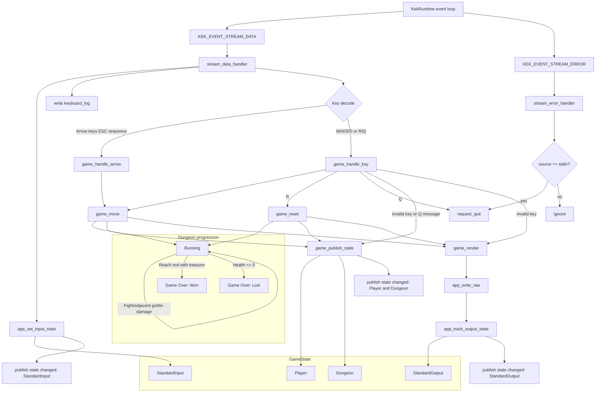

# Tiny Dungeon: States, Hooks, and Transitions

This diagram shows how runtime events trigger hooks, how hooks mutate state, and when state change notifications are published.

## Notes

- `StandardInput` is updated for every incoming stream data event.
- `Player` and `Dungeon` are published together via `game_publish_state`.
- `StandardOutput` is updated as part of rendering/write calls.
- Restart (`R`) resets gameplay state while preserving stream-backed I/O state.
