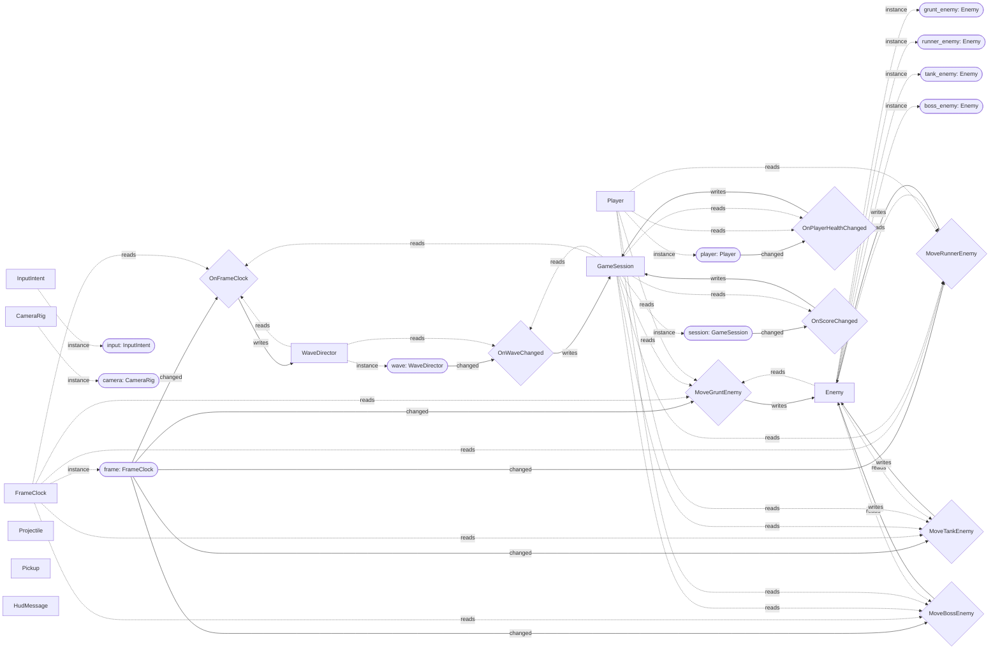

<!-- Generated by tools/generate_states.py. Do not edit manually. -->
# game_state State Graph

```mermaid
flowchart LR
    S_FrameClock["FrameClock"]
    S_GameSession["GameSession"]
    S_InputIntent["InputIntent"]
    S_Player["Player"]
    S_WaveDirector["WaveDirector"]
    S_CameraRig["CameraRig"]
    S_Enemy["Enemy"]
    S_Projectile["Projectile"]
    S_Pickup["Pickup"]
    S_HudMessage["HudMessage"]
    H_OnFrameClock{"OnFrameClock"}
    H_MoveGruntEnemy{"MoveGruntEnemy"}
    H_MoveRunnerEnemy{"MoveRunnerEnemy"}
    H_MoveTankEnemy{"MoveTankEnemy"}
    H_MoveBossEnemy{"MoveBossEnemy"}
    H_OnPlayerHealthChanged{"OnPlayerHealthChanged"}
    H_OnWaveChanged{"OnWaveChanged"}
    H_OnScoreChanged{"OnScoreChanged"}
    I_frame(["frame: FrameClock"])
    S_FrameClock -. instance .-> I_frame
    I_session(["session: GameSession"])
    S_GameSession -. instance .-> I_session
    I_input(["input: InputIntent"])
    S_InputIntent -. instance .-> I_input
    I_player(["player: Player"])
    S_Player -. instance .-> I_player
    I_wave(["wave: WaveDirector"])
    S_WaveDirector -. instance .-> I_wave
    I_camera(["camera: CameraRig"])
    S_CameraRig -. instance .-> I_camera
    I_grunt_enemy(["grunt_enemy: Enemy"])
    S_Enemy -. instance .-> I_grunt_enemy
    I_runner_enemy(["runner_enemy: Enemy"])
    S_Enemy -. instance .-> I_runner_enemy
    I_tank_enemy(["tank_enemy: Enemy"])
    S_Enemy -. instance .-> I_tank_enemy
    I_boss_enemy(["boss_enemy: Enemy"])
    S_Enemy -. instance .-> I_boss_enemy
    I_frame -->|changed| H_OnFrameClock
    S_FrameClock -. reads .-> H_OnFrameClock
    S_GameSession -. reads .-> H_OnFrameClock
    S_WaveDirector -. reads .-> H_OnFrameClock
    H_OnFrameClock -->|writes| S_WaveDirector
    I_frame -->|changed| H_MoveGruntEnemy
    S_FrameClock -. reads .-> H_MoveGruntEnemy
    S_GameSession -. reads .-> H_MoveGruntEnemy
    S_Player -. reads .-> H_MoveGruntEnemy
    S_Enemy -. reads .-> H_MoveGruntEnemy
    H_MoveGruntEnemy -->|writes| S_Enemy
    I_frame -->|changed| H_MoveRunnerEnemy
    S_FrameClock -. reads .-> H_MoveRunnerEnemy
    S_GameSession -. reads .-> H_MoveRunnerEnemy
    S_Player -. reads .-> H_MoveRunnerEnemy
    S_Enemy -. reads .-> H_MoveRunnerEnemy
    H_MoveRunnerEnemy -->|writes| S_Enemy
    I_frame -->|changed| H_MoveTankEnemy
    S_FrameClock -. reads .-> H_MoveTankEnemy
    S_GameSession -. reads .-> H_MoveTankEnemy
    S_Player -. reads .-> H_MoveTankEnemy
    S_Enemy -. reads .-> H_MoveTankEnemy
    H_MoveTankEnemy -->|writes| S_Enemy
    I_frame -->|changed| H_MoveBossEnemy
    S_FrameClock -. reads .-> H_MoveBossEnemy
    S_GameSession -. reads .-> H_MoveBossEnemy
    S_Player -. reads .-> H_MoveBossEnemy
    S_Enemy -. reads .-> H_MoveBossEnemy
    H_MoveBossEnemy -->|writes| S_Enemy
    I_player -->|changed| H_OnPlayerHealthChanged
    S_Player -. reads .-> H_OnPlayerHealthChanged
    S_GameSession -. reads .-> H_OnPlayerHealthChanged
    H_OnPlayerHealthChanged -->|writes| S_GameSession
    I_wave -->|changed| H_OnWaveChanged
    S_WaveDirector -. reads .-> H_OnWaveChanged
    S_GameSession -. reads .-> H_OnWaveChanged
    H_OnWaveChanged -->|writes| S_GameSession
    I_session -->|changed| H_OnScoreChanged
    S_GameSession -. reads .-> H_OnScoreChanged
    H_OnScoreChanged -->|writes| S_GameSession
```
